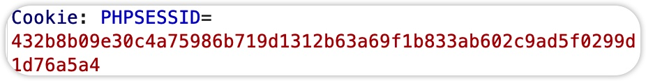
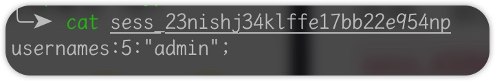

# php session伪造

## session存储位置

在开发的时候我们可以通过如下语句来指定php session文件的存放位置：

```php
session_save_path("/tmp/");
session_start();
```

php的session默认存储文件名是sess_+PHPSESSID的值，如下图是一个标准的php session



## 生成session文件

我们可以通过如下文件来生成一个session文件：

```php
<?php
ini_set('session.serialize_handler', 'php_binary');
session_save_path("/tmp/");
session_start();

$_SESSION['username'] = 'admin';
```

如下图就是生成的session值：



## 利用

在比赛当中，可以通过上传文件到php sessionid文件的位置来修改我们的session。

以上图为例我们就可以设置Cookie为```PHPSESSID=23nishj34klffe17bb22e954np```，从而获得管理员权限。