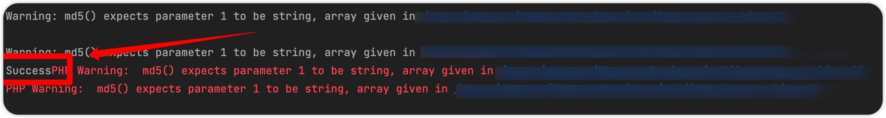
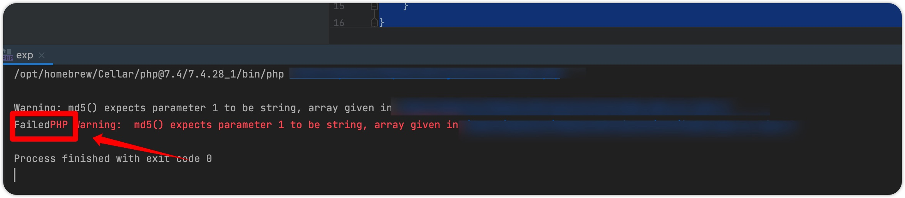

# php一些绕过总结（持续更新）

## Exception（Error）类绕过md5、sha1

### 一般绕过

这种绕过方式一般适用于反序列化中，因为普通的强类型比较我们可以用数组绕过，例如下面的代码：

```php
$var1[] = 1;
$var2[] = 2;
if ((md5($var1) === md5($var2)) && ($var1!=$var2)){
    echo "Success";
}
```



虽然报了Warning但还是成功了。

### 在类里面绕过

但是当一个类被反序列化后比较类中的元素时，我们无法使用数组绕过，给定如下代码：

```php
<?php

class CMP_TEST{
    public $var1;
    public $var2;

    public function __wakeup()
    {
        if ((md5($this->var1) === md5($this->var2)) && ($this->var1!=$this->var2)){
            echo "Success";
    }
        else{
            die("Failed");
        }
    }
}


$A = new CMP_TEST();
$A->var1[]=1;
$A->var1[]=2;

unserialize(serialize($A));
```



如图可见比较失败，此时我们可以使用php的原生Exception或者Error类来进行绕过。

例如下面代码：

```php
<?php

class CMP_TEST{
    public $var1;
    public $var2;

    public function __wakeup()
    {
        if ((md5($this->var1) === md5($this->var2)) && ($this->var1!=$this->var2)){
            echo "Success";
    }
        else{
            die("Failed");
        }
    }
}


$A = new CMP_TEST();
$A->var1 = new Error("payload",1);$A->var2 = new Error("payload",2);
unserialize(serialize($A));
```


可见比较成功。

### 原理

为什么利用原生的error类的时候可以比较成功呢，因为在当传入一个类的时候，md5和sha函数都会调用这个类的\__toString方法，简单一点来说，就是这两个类不同，但是类的\__toString输出的内容是一样的，这样就会比较成功。

下面的代码是一个例子：

```php
<?php

$var1 = new Error("payload",1);$var2 = new Error("payload",2);
var_dump($var1);
var_dump($var2);

#var_dump($var1->__toString());
#var_dump($var2->__toString());

echo "\n以下是比较结果\n";
var_dump($var1===$var2);
var_dump(md5($var1)===md5($var2));
```

这是输出结果：

```
object(Error)#1 (7) {
  ["message":protected]=>
  string(7) "payload"
  ["string":"Error":private]=>
  string(0) ""
  ["code":protected]=>
  int(1)
  ["file":protected]=>
  string(43) "/PhpstormProjects/ctf/exp.php"
  ["line":protected]=>
  int(3)
  ["trace":"Error":private]=>
  array(0) {
  }
  ["previous":"Error":private]=>
  NULL
}
object(Error)#2 (7) {
  ["message":protected]=>
  string(7) "payload"
  ["string":"Error":private]=>
  string(0) ""
  ["code":protected]=>
  int(2)
  ["file":protected]=>
  string(43) "/PhpstormProjects/ctf/exp.php"
  ["line":protected]=>
  int(3)
  ["trace":"Error":private]=>
  array(0) {
  }
  ["previous":"Error":private]=>
  NULL
}

以下是比较结果
bool(false)
bool(true)
```

```var_dump($var1===$var2);```比较的其实就是```var_dump($var1);var_dump($var2);```的值，可见两者是明显不同的。

再看看下面的php代码：

```php
<?php

$var1 = new Error("payload",1);$var2 = new Error("payload",2);
#var_dump($var1);
#var_dump($var2);

var_dump($var1->__toString());
var_dump($var2->__toString());

echo "\n以下是比较结果\n";
var_dump($var1===$var2);
var_dump(md5($var1)===md5($var2));
```

这是输出结果：

```
string(86) "Error: payload in 
/PhpstormProjects/ctf/exp.php:3
Stack trace:
#0 {main}"
string(86) "Error: payload in 
/PhpstormProjects/ctf/exp.php:3
Stack trace:
#0 {main}"

以下是比较结果
bool(false)
bool(true)
```

可见当调用了\__toString方法后，输出的内容变成了一样的。从而比较成功。

另外需要注意将两个语句写到同一行，```$var1 = new Error("payload",1);$var2 = new Error("payload",2);```，因为Error输出的时候包含行号，不在同一行就会出现不相等的情况。