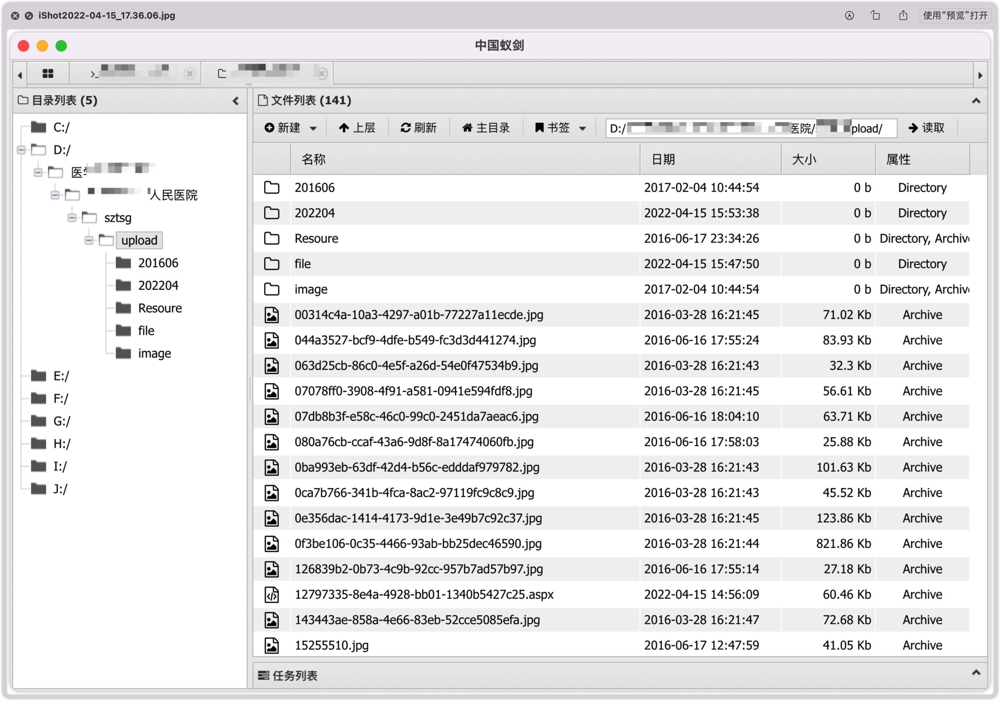

# 从弱口令到getshell

## 前台审计

拿到网站后，我们先看看长啥样：

是一个图书管理系统，目光敏锐的人一眼就能看见最底下的后台登陆，二话不说立即打开看看啥样：

一般拿到这种后台先不要直接上SQL注入啥的，先看看是不是存在弱口令或者逻辑认证漏洞可以跳过登陆等等，这次我运气比较好，存在弱口令，直接登录后台：

渗透测试到这里肯定不会就结束了，既然登录后台了就要看看怎么拿shell。

## 后台上传

在后台翻来翻去发现存在一个疑似上传点，是管理员用来上传工具的：

抱着试一试的心态我决定传一个webshell上去，考虑到这个站的ASP.net版本比较老了，冰蝎，哥斯拉等工具的webshell可能不会解析，所以我就用了普通的一句话木马稍微变形一下来达到免杀的效果。发现上传成功：

上传成功后发现页面并没有返回webshell的地址，这个有点麻烦，因为就算上传成功了找不到也没办法，观察页面发现前台存在资源检索功能，会不会能检索到webshell呢，然后就去试了一试，发现果然能检索到刚刚的webshell，使用在线阅览然后在页面源码中找到webshell地址：

点进去看看是否被解析了，页面没有任何回显，一般这种情况就代表生效了

接下来就是用蚁剑连接了，成功连接，收工。

## 总结

这次渗透测试的运气成分居多，首先是弱口令，然后管理员并没有配置上传目录不解析（肯定过不了等保了哈哈）导致登入后台后轻松getshell，总之并不是很难，也就练个手的难度。

